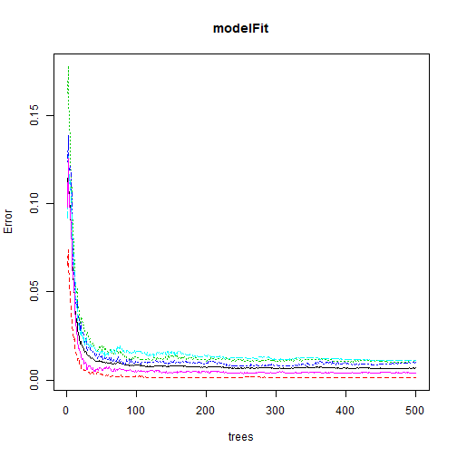
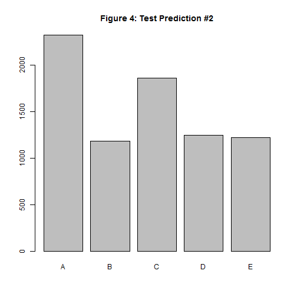

<!-- rmarkdown v1 -->


# Practical Machine Learning - Peer Graded Assignment

### Summary
One thing that people regularly do is quantify how much of a particular activity they do, but they rarely quantify how well they do it. In this project, your goal will be to use data from accelerometers on the belt, forearm, arm, and dumbell of 6 participants.

The goal of you project is to predict the manner in which they did the exercise. This is the "classe" variable in the training set. You may use any of the other variables to predict with. You should create a report describing how you built your model, how you used cross validation, what you think the expected out of sample error is, and why you made the choices you did. You will also use your prediction model to predict 20 different test cases.


```
## Loading required package: lattice
```

```
## randomForest 4.6-14
```

```
## Type rfNews() to see new features/changes/bug fixes.
```

```
## 
## Attaching package: 'randomForest'
```

```
## The following object is masked from 'package:ggplot2':
## 
##     margin
```


 

```
## [1] 19622   160
```

```
## [1]  20 160
```

```
##  Factor w/ 5 levels "A","B","C","D",..: 1 1 1 1 1 1 1 1 1 1 ...
```

```
##    A    B    C    D    E 
## 5580 3797 3422 3216 3607
```

```r
inTrain <- createDataPartition(y=dataTraining$classe,p=0.6,list=FALSE)
myTrain <- dataTraining[inTrain, ]
myTest <- dataTraining[-inTrain, ]

dim(myTrain)
```

```
## [1] 11776   160
```

```r
## Remove variables that are most NAs.
myTrainClean <- myTrain
for (i in 1:length(myTrain)) {
  if (sum(is.na(myTrain[ , i])) / nrow(myTrain) >= .75) {
    for (j in 1:length(myTrainClean)) {
      if (length(grep(names(myTrain[i]), names(myTrainClean)[j]))==1) {
        myTrainClean <- myTrainClean[ , -j]
      }
    }
  }
}

dim(myTrainClean)
```

```
## [1] 11776    60
```

```r
## Remove unneccessary columns
myTrainingNew <- myTrainClean[,8:length(myTrainClean)]

## Remove near zero variables
nearZero <- nearZeroVar(myTrainingNew,saveMetrics=TRUE)
nearZero
```

```
##                      freqRatio percentUnique zeroVar   nzv
## roll_belt             1.118774    8.68716033   FALSE FALSE
## pitch_belt            1.043478   13.71433424   FALSE FALSE
## yaw_belt              1.088816   14.60597826   FALSE FALSE
## total_accel_belt      1.077526    0.23777174   FALSE FALSE
## gyros_belt_x          1.015892    1.05298913   FALSE FALSE
## gyros_belt_y          1.165171    0.52649457   FALSE FALSE
## gyros_belt_z          1.066603    1.37567935   FALSE FALSE
## accel_belt_x          1.031056    1.31623641   FALSE FALSE
## accel_belt_y          1.073434    1.16338315   FALSE FALSE
## accel_belt_z          1.102317    2.42866848   FALSE FALSE
## magnet_belt_x         1.078341    2.43716033   FALSE FALSE
## magnet_belt_y         1.035000    2.42866848   FALSE FALSE
## magnet_belt_z         1.059859    3.57506793   FALSE FALSE
## roll_arm             53.421053   19.35292120   FALSE FALSE
## pitch_arm            81.200000   22.61379076   FALSE FALSE
## yaw_arm              35.000000   21.30604620   FALSE FALSE
## total_accel_arm       1.083491    0.55197011   FALSE FALSE
## gyros_arm_x           1.009615    5.28192935   FALSE FALSE
## gyros_arm_y           1.463492    3.09952446   FALSE FALSE
## gyros_arm_z           1.167224    1.94463315   FALSE FALSE
## accel_arm_x           1.049505    6.39436141   FALSE FALSE
## accel_arm_y           1.118519    4.43274457   FALSE FALSE
## accel_arm_z           1.126582    6.41983696   FALSE FALSE
## magnet_arm_x          1.018868   11.14979620   FALSE FALSE
## magnet_arm_y          1.000000    7.18410326   FALSE FALSE
## magnet_arm_z          1.074627   10.59782609   FALSE FALSE
## roll_dumbbell         1.066667   87.55944293   FALSE FALSE
## pitch_dumbbell        2.300000   85.41100543   FALSE FALSE
## yaw_dumbbell          1.126761   87.01596467   FALSE FALSE
## total_accel_dumbbell  1.016548    0.35665761   FALSE FALSE
## gyros_dumbbell_x      1.041096    1.92764946   FALSE FALSE
## gyros_dumbbell_y      1.237057    2.22486413   FALSE FALSE
## gyros_dumbbell_z      1.019391    1.63892663   FALSE FALSE
## accel_dumbbell_x      1.004878    3.39673913   FALSE FALSE
## accel_dumbbell_y      1.164384    3.79585598   FALSE FALSE
## accel_dumbbell_z      1.151724    3.30332880   FALSE FALSE
## magnet_dumbbell_x     1.009259    8.81453804   FALSE FALSE
## magnet_dumbbell_y     1.044248    6.88688859   FALSE FALSE
## magnet_dumbbell_z     1.044643    5.57914402   FALSE FALSE
## roll_forearm         12.244792   14.92866848   FALSE FALSE
## pitch_forearm        71.181818   21.14470109   FALSE FALSE
## yaw_forearm          15.453947   14.13892663   FALSE FALSE
## total_accel_forearm   1.143826    0.56895380   FALSE FALSE
## gyros_forearm_x       1.068182    2.32676630   FALSE FALSE
## gyros_forearm_y       1.077922    6.02921196   FALSE FALSE
## gyros_forearm_z       1.064407    2.38620924   FALSE FALSE
## accel_forearm_x       1.018182    6.58118207   FALSE FALSE
## accel_forearm_y       1.163934    8.18614130   FALSE FALSE
## accel_forearm_z       1.065934    4.61107337   FALSE FALSE
## magnet_forearm_x      1.020000   12.06691576   FALSE FALSE
## magnet_forearm_y      1.240000   15.30230978   FALSE FALSE
## magnet_forearm_z      1.000000   13.45957880   FALSE FALSE
## classe                1.469065    0.04245924   FALSE FALSE
```
### Random Decision Forest

```r
## Random Forest
set.seed(123)
modelFit <- randomForest(classe~.,data=myTrainingNew)

plot(modelFit)
```



```r
print(modelFit,main="Figure 1: Model Fitting #1")
```

```
## 
## Call:
##  randomForest(formula = classe ~ ., data = myTrainingNew) 
##                Type of random forest: classification
##                      Number of trees: 500
## No. of variables tried at each split: 7
## 
##         OOB estimate of  error rate: 0.68%
## Confusion matrix:
##      A    B    C    D    E class.error
## A 3344    4    0    0    0 0.001194743
## B   19 2254    6    0    0 0.010969724
## C    0   16 2033    5    0 0.010223953
## D    0    0   20 1909    1 0.010880829
## E    0    0    2    7 2156 0.004157044
```

```r
dataModel <- rpart(classe ~ .,data=myTrainingNew,method="class")

## Cross Validation
# Prediction 1
testPrediction <- predict(modelFit,myTest,type="class")
plot(testPrediction,main="Figure 2: Test Prediction #1")
```


```r
confusionMatrix(testPrediction,myTest$classe)
```

```
## Confusion Matrix and Statistics
## 
##           Reference
## Prediction    A    B    C    D    E
##          A 2231   10    0    0    0
##          B    1 1506    9    0    0
##          C    0    2 1358   10    1
##          D    0    0    1 1275    7
##          E    0    0    0    1 1434
## 
## Overall Statistics
##                                           
##                Accuracy : 0.9946          
##                  95% CI : (0.9928, 0.9961)
##     No Information Rate : 0.2845          
##     P-Value [Acc > NIR] : < 2.2e-16       
##                                           
##                   Kappa : 0.9932          
##                                           
##  Mcnemar's Test P-Value : NA              
## 
## Statistics by Class:
## 
##                      Class: A Class: B Class: C Class: D Class: E
## Sensitivity            0.9996   0.9921   0.9927   0.9914   0.9945
## Specificity            0.9982   0.9984   0.9980   0.9988   0.9998
## Pos Pred Value         0.9955   0.9934   0.9905   0.9938   0.9993
## Neg Pred Value         0.9998   0.9981   0.9985   0.9983   0.9988
## Prevalence             0.2845   0.1935   0.1744   0.1639   0.1838
## Detection Rate         0.2843   0.1919   0.1731   0.1625   0.1828
## Detection Prevalence   0.2856   0.1932   0.1747   0.1635   0.1829
## Balanced Accuracy      0.9989   0.9953   0.9953   0.9951   0.9971
```

```r
# Prediction 2
modelFit2 <- randomForest(classe ~. ,data=myTrainingNew,method="class")
plot(modelFit2,main="Figure 3: Model Fitting #2")
```


```r
testPrediction2 <- predict(dataModel,myTest,type="class")
plot(testPrediction2,main="Figure 4: Test Prediction #2")
```



```r
confusionMatrix(testPrediction2,myTest$classe)
```

```
## Confusion Matrix and Statistics
## 
##           Reference
## Prediction    A    B    C    D    E
##          A 2006  229   23   58   11
##          B   64  865   55   98  103
##          C   54  292 1184  142  189
##          D   83   96  104  853  111
##          E   25   36    2  135 1028
## 
## Overall Statistics
##                                          
##                Accuracy : 0.7566         
##                  95% CI : (0.7469, 0.766)
##     No Information Rate : 0.2845         
##     P-Value [Acc > NIR] : < 2.2e-16      
##                                          
##                   Kappa : 0.692          
##                                          
##  Mcnemar's Test P-Value : < 2.2e-16      
## 
## Statistics by Class:
## 
##                      Class: A Class: B Class: C Class: D Class: E
## Sensitivity            0.8987   0.5698   0.8655   0.6633   0.7129
## Specificity            0.9428   0.9494   0.8955   0.9399   0.9691
## Pos Pred Value         0.8621   0.7300   0.6362   0.6840   0.8385
## Neg Pred Value         0.9591   0.9020   0.9693   0.9344   0.9375
## Prevalence             0.2845   0.1935   0.1744   0.1639   0.1838
## Detection Rate         0.2557   0.1102   0.1509   0.1087   0.1310
## Detection Prevalence   0.2966   0.1510   0.2372   0.1589   0.1563
## Balanced Accuracy      0.9208   0.7596   0.8805   0.8016   0.8410
```
