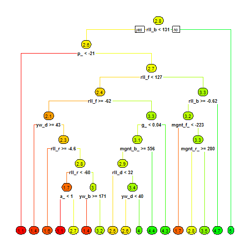
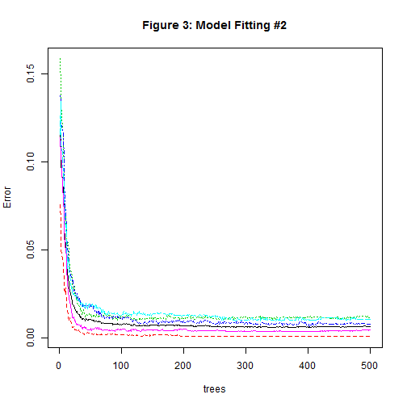

<!-- rmarkdown v1 -->


# Practical Machine Learning - Peer Graded Assignment

### Summary
One thing that people regularly do is quantify how much of a particular activity they do, but they rarely quantify how well they do it. In this project, your goal will be to use data from accelerometers on the belt, forearm, arm, and dumbell of 6 participants.

The goal of you project is to predict the manner in which they did the exercise. This is the "classe" variable in the training set. You may use any of the other variables to predict with. You should create a report describing how you built your model, how you used cross validation, what you think the expected out of sample error is, and why you made the choices you did. You will also use your prediction model to predict 20 different test cases.


```
## Loading required package: lattice
```

```
## randomForest 4.6-14
```

```
## Type rfNews() to see new features/changes/bug fixes.
```

```
## 
## Attaching package: 'randomForest'
```

```
## The following object is masked from 'package:ggplot2':
## 
##     margin
```


 

```
## [1] 19622   160
```

```
## [1]  20 160
```

```
##  Factor w/ 5 levels "A","B","C","D",..: 1 1 1 1 1 1 1 1 1 1 ...
```

```
##    A    B    C    D    E 
## 5580 3797 3422 3216 3607
```

```r
inTrain <- createDataPartition(y=dataTraining$classe,p=0.6,list=FALSE)
myTrain <- dataTraining[inTrain, ]
myTest <- dataTraining[-inTrain, ]

dim(myTrain)
```

```
## [1] 11776   160
```

```r
## Remove variables that are most NAs.
myTrainClean <- myTrain
for (i in 1:length(myTrain)) {
  if (sum(is.na(myTrain[ , i])) / nrow(myTrain) >= .75) {
    for (j in 1:length(myTrainClean)) {
      if (length(grep(names(myTrain[i]), names(myTrainClean)[j]))==1) {
        myTrainClean <- myTrainClean[ , -j]
      }
    }
  }
}

dim(myTrainClean)
```

```
## [1] 11776    60
```

```r
## Remove unneccessary columns
myTrainingNew <- myTrainClean[,8:length(myTrainClean)]

## Remove near zero variables
nearZero <- nearZeroVar(myTrainingNew,saveMetrics=TRUE)
nearZero
```

```
##                      freqRatio percentUnique zeroVar   nzv
## roll_belt             1.111332    8.68716033   FALSE FALSE
## pitch_belt            1.051724   13.54449728   FALSE FALSE
## yaw_belt              1.087948   14.46161685   FALSE FALSE
## total_accel_belt      1.088540    0.24626359   FALSE FALSE
## gyros_belt_x          1.023753    1.05298913   FALSE FALSE
## gyros_belt_y          1.143371    0.52649457   FALSE FALSE
## gyros_belt_z          1.046296    1.37567935   FALSE FALSE
## accel_belt_x          1.014989    1.34171196   FALSE FALSE
## accel_belt_y          1.120482    1.12092391   FALSE FALSE
## accel_belt_z          1.055133    2.38620924   FALSE FALSE
## magnet_belt_x         1.073059    2.47961957   FALSE FALSE
## magnet_belt_y         1.158163    2.41168478   FALSE FALSE
## magnet_belt_z         1.133829    3.55808424   FALSE FALSE
## roll_arm             48.714286   19.59069293   FALSE FALSE
## pitch_arm            89.000000   22.24014946   FALSE FALSE
## yaw_arm              33.540984   21.39096467   FALSE FALSE
## total_accel_arm       1.060150    0.56046196   FALSE FALSE
## gyros_arm_x           1.015974    5.29042120   FALSE FALSE
## gyros_arm_y           1.533981    3.08254076   FALSE FALSE
## gyros_arm_z           1.078864    1.91915761   FALSE FALSE
## accel_arm_x           1.027523    6.40285326   FALSE FALSE
## accel_arm_y           1.031008    4.38179348   FALSE FALSE
## accel_arm_z           1.075949    6.47927989   FALSE FALSE
## magnet_arm_x          1.037736   11.14130435   FALSE FALSE
## magnet_arm_y          1.056604    7.23505435   FALSE FALSE
## magnet_arm_z          1.015152   10.60631793   FALSE FALSE
## roll_dumbbell         1.013514   87.43206522   FALSE FALSE
## pitch_dumbbell        2.320000   85.25815217   FALSE FALSE
## yaw_dumbbell          1.013514   86.88858696   FALSE FALSE
## total_accel_dumbbell  1.077111    0.35665761   FALSE FALSE
## gyros_dumbbell_x      1.013736    1.97010870   FALSE FALSE
## gyros_dumbbell_y      1.197333    2.21637228   FALSE FALSE
## gyros_dumbbell_z      1.092391    1.64741848   FALSE FALSE
## accel_dumbbell_x      1.015000    3.37126359   FALSE FALSE
## accel_dumbbell_y      1.074830    3.74490489   FALSE FALSE
## accel_dumbbell_z      1.046667    3.35427989   FALSE FALSE
## magnet_dumbbell_x     1.018692    8.85699728   FALSE FALSE
## magnet_dumbbell_y     1.107143    6.90387228   FALSE FALSE
## magnet_dumbbell_z     1.000000    5.55366848   FALSE FALSE
## roll_forearm         11.615764   14.92866848   FALSE FALSE
## pitch_forearm        65.500000   20.94938859   FALSE FALSE
## yaw_forearm          14.917722   14.19836957   FALSE FALSE
## total_accel_forearm   1.106021    0.54347826   FALSE FALSE
## gyros_forearm_x       1.089172    2.42017663   FALSE FALSE
## gyros_forearm_y       1.038627    6.02921196   FALSE FALSE
## gyros_forearm_z       1.127586    2.37771739   FALSE FALSE
## accel_forearm_x       1.148148    6.51324728   FALSE FALSE
## accel_forearm_y       1.049180    8.16066576   FALSE FALSE
## accel_forearm_z       1.009709    4.62805707   FALSE FALSE
## magnet_forearm_x      1.080000   12.02445652   FALSE FALSE
## magnet_forearm_y      1.094340   15.18342391   FALSE FALSE
## magnet_forearm_z      1.105263   13.30672554   FALSE FALSE
## classe                1.469065    0.04245924   FALSE FALSE
```
### Random Decision Forest

```r
## Random Forest
set.seed(123)
modelFit <- randomForest(classe~.,data=myTrainingNew)
print(modelFit)
```

```
## 
## Call:
##  randomForest(formula = classe ~ ., data = myTrainingNew) 
##                Type of random forest: classification
##                      Number of trees: 500
## No. of variables tried at each split: 7
## 
##         OOB estimate of  error rate: 0.7%
## Confusion matrix:
##      A    B    C    D    E  class.error
## A 3345    2    0    0    1 0.0008960573
## B   13 2256    9    1    0 0.0100921457
## C    0   13 2037    4    0 0.0082765336
## D    0    0   28 1901    1 0.0150259067
## E    0    0    3    7 2155 0.0046189376
```

```r
dataModel <- rpart(classe ~ .,data=myTrainingNew,method="class")
rpart.plot(dataModel,main="Figure 1: Classification",extra=100,under=TRUE,faclen=0)
```



```r
heat.tree <- function(tree, low.is.green = FALSE, ...) 
  { 
    # dots args passed to prp
    y <- tree$frame$yval
    if(low.is.green)
      y <- -y
    max <- max(y)
    min <- min(y)
    cols <- rainbow(99, end = .36)[
            ifelse(y > y[1], (y-y[1]) * (99-50) / (max-y[1]) + 50,
                  (y-min) * (50-1) / (y[1]-min) + 1)]
    prp(tree, branch.col = cols, box.col = cols, ...)
  }

treeModel <- rpart(classe ~ ., data=myTrainingNew,method="anova")
heat.tree(main="Figure 2: Heat Tree" ,treeModel,type=2,varlen=2,fallen.leaves=TRUE)
```



```r
## Cross Validation
# Prediction 1
testPrediction <- predict(modelFit,myTest,type="class")
confusionMatrix(testPrediction,myTest$classe)
```

```
## Confusion Matrix and Statistics
## 
##           Reference
## Prediction    A    B    C    D    E
##          A 2231    9    0    0    0
##          B    1 1507    9    0    0
##          C    0    2 1354   15    1
##          D    0    0    5 1269    1
##          E    0    0    0    2 1440
## 
## Overall Statistics
##                                           
##                Accuracy : 0.9943          
##                  95% CI : (0.9923, 0.9958)
##     No Information Rate : 0.2845          
##     P-Value [Acc > NIR] : < 2.2e-16       
##                                           
##                   Kappa : 0.9927          
##                                           
##  Mcnemar's Test P-Value : NA              
## 
## Statistics by Class:
## 
##                      Class: A Class: B Class: C Class: D Class: E
## Sensitivity            0.9996   0.9928   0.9898   0.9868   0.9986
## Specificity            0.9984   0.9984   0.9972   0.9991   0.9997
## Pos Pred Value         0.9960   0.9934   0.9869   0.9953   0.9986
## Neg Pred Value         0.9998   0.9983   0.9978   0.9974   0.9997
## Prevalence             0.2845   0.1935   0.1744   0.1639   0.1838
## Detection Rate         0.2843   0.1921   0.1726   0.1617   0.1835
## Detection Prevalence   0.2855   0.1933   0.1749   0.1625   0.1838
## Balanced Accuracy      0.9990   0.9956   0.9935   0.9929   0.9992
```

```r
# Prediction 2
modelFit2 <- randomForest(classe ~. ,data=myTrainingNew,method="class")
testPrediction2 <- predict(dataModel,myTest,type="class")
confusionMatrix(testPrediction2,myTest$classe)
```

```
## Confusion Matrix and Statistics
## 
##           Reference
## Prediction    A    B    C    D    E
##          A 2052  231   37   88   54
##          B   68  904  125  110  126
##          C   47  196 1075  182  158
##          D   27  116   83  810   76
##          E   38   71   48   96 1028
## 
## Overall Statistics
##                                           
##                Accuracy : 0.748           
##                  95% CI : (0.7383, 0.7576)
##     No Information Rate : 0.2845          
##     P-Value [Acc > NIR] : < 2.2e-16       
##                                           
##                   Kappa : 0.6801          
##                                           
##  Mcnemar's Test P-Value : < 2.2e-16       
## 
## Statistics by Class:
## 
##                      Class: A Class: B Class: C Class: D Class: E
## Sensitivity            0.9194   0.5955   0.7858   0.6299   0.7129
## Specificity            0.9270   0.9322   0.9100   0.9540   0.9605
## Pos Pred Value         0.8335   0.6782   0.6484   0.7284   0.8025
## Neg Pred Value         0.9666   0.9057   0.9527   0.9293   0.9369
## Prevalence             0.2845   0.1935   0.1744   0.1639   0.1838
## Detection Rate         0.2615   0.1152   0.1370   0.1032   0.1310
## Detection Prevalence   0.3138   0.1699   0.2113   0.1417   0.1633
## Balanced Accuracy      0.9232   0.7639   0.8479   0.7919   0.8367
```

```r
# Final Prediction
finalPrediction <- predict(modelFit2,myTest,type="class")
finalPrediction
```

```
##     1     2     5     8     9    33    36    38    39    44    45    46 
##     A     A     A     A     A     A     A     A     A     A     A     A 
##    47    53    54    57    62    63    64    66    67    71    77    78 
##     A     A     A     A     A     A     A     A     A     A     A     A 
##    81    87    88    90    93    95    97    99   100   101   110   113 
##     A     A     A     A     A     A     A     A     A     A     A     A 
##   118   119   120   121   124   126   127   129   130   133   135   136 
##     A     A     A     A     A     A     A     A     A     A     A     A 
##   141   145   148   154   158   160   162   164   169   170   171   173 
##     A     A     A     A     A     A     A     A     A     A     A     A 
##   174   176   177   179   182   183   187   188   192   193   194   196 
##     A     A     A     A     A     A     A     A     A     A     A     A 
##   197   200   202   204   208   211   219   220   221   222   224   227 
##     A     A     A     A     A     A     A     A     A     A     A     A 
##   228   229   235   236   237   240   243   248   252   255   256   259 
##     A     A     A     A     A     A     A     A     A     A     A     A 
##   260   261   264   266   267   270   271   273   275   276   284   288 
##     A     A     A     A     A     A     A     A     A     A     A     A 
##   289   291   293   294   297   300   303   304   305   306   309   313 
##     A     A     A     A     A     A     A     A     A     A     A     A 
##   314   318   319   322   325   326   328   334   336   337   338   339 
##     A     A     A     A     A     A     A     A     A     A     A     A 
##   348   352   353   360   364   365   366   369   372   375   376   379 
##     A     A     A     A     A     A     A     A     A     A     A     A 
##   384   385   388   393   394   397   398   399   400   402   403   410 
##     A     A     A     A     A     A     A     A     A     A     A     A 
##   414   415   416   418   419   420   422   424   425   426   431   438 
##     A     A     A     A     A     A     A     A     A     A     A     A 
##   439   441   444   445   446   448   451   452   454   455   459   461 
##     A     A     A     A     A     A     A     A     A     A     A     A 
##   462   464   467   468   470   473   474   475   483   486   489   490 
##     A     A     A     A     A     A     A     A     A     A     A     A 
##   491   494   500   501   502   504   506   507   508   509   510   512 
##     A     A     A     A     A     A     A     A     A     A     A     A 
##   513   515   519   520   524   525   527   532   535   537   538   540 
##     A     A     A     A     A     A     A     A     A     A     A     A 
##   545   547   548   552   555   557   559   561   565   576   578   580 
##     A     A     A     A     A     A     A     A     A     A     A     A 
##   581   582   585   592   593   594   595   600   602   605   607   610 
##     A     A     A     A     A     A     A     A     A     A     A     A 
##   613   618   619   622   623   624   626   630   635   639   642   647 
##     A     A     A     A     A     A     A     A     A     A     A     A 
##   652   653   654   657   660   663   664   666   668   669   670   671 
##     A     A     A     A     A     A     A     A     A     A     A     A 
##   673   674   677   683   687   692   695   700   701   704   706   710 
##     A     A     A     A     A     A     A     A     A     A     A     A 
##   711   718   721   722   727   728   730   732   738   750   757   762 
##     A     A     A     A     A     A     A     A     A     A     A     A 
##   767   769   770   771   773   778   782   783   785   788   789   792 
##     A     A     A     A     A     A     A     A     A     A     A     A 
##   793   794   797   798   800   802   805   806   807   809   810   812 
##     A     A     A     A     A     A     A     A     A     A     A     A 
##   815   818   819   821   822   823   824   826   829   830   831   835 
##     A     A     A     A     A     A     A     A     A     A     A     A 
##   838   841   842   844   847   849   850   851   853   859   862   866 
##     A     A     A     A     A     A     A     A     A     A     A     A 
##   869   870   871   874   881   882   883   885   888   890   892   900 
##     A     A     A     A     A     A     A     A     A     A     A     A 
##   911   912   913   915   916   920   921   923   925   928   929   930 
##     A     A     A     A     A     A     A     A     A     A     A     A 
##   933   934   937   939   945   946   951   952   957   959   968   970 
##     A     A     A     A     A     A     A     A     A     A     A     A 
##   976   978   979   980   982   986   987   988   993   996  1000  1001 
##     A     A     A     A     A     A     A     A     A     A     A     A 
##  1003  1007  1009  1012  1016  1017  1018  1019  1023  1025  1029  1037 
##     A     A     A     A     A     A     A     A     A     A     A     A 
##  1038  1039  1042  1043  1044  1046  1047  1049  1051  1052  1055  1056 
##     A     A     A     A     A     A     A     A     A     A     A     A 
##  1057  1058  1060  1061  1064  1065  1070  1071  1073  1076  1078  1081 
##     A     A     A     A     A     A     A     A     A     A     A     A 
##  1088  1091  1093  1096  1097  1099  1100  1105  1107  1108  1109  1111 
##     A     A     A     A     A     A     A     A     A     A     A     A 
##  1115  1117  1120  1123  1125  1128  1130  1134  1135  1137  1143  1147 
##     A     A     A     A     A     A     A     A     A     A     A     A 
##  1154  1158  1164  1165  1168  1169  1171  1175  1178  1182  1185  1186 
##     A     A     A     A     A     A     A     A     A     A     A     A 
##  1187  1190  1194  1197  1198  1201  1205  1206  1208  1212  1215  1218 
##     A     A     A     A     A     A     A     A     A     A     A     A 
##  1221  1222  1225  1226  1230  1234  1235  1237  1238  1242  1246  1247 
##     A     A     A     A     A     A     A     A     A     A     A     A 
##  1250  1251  1256  1257  1258  1260  1265  1268  1272  1275  1276  1277 
##     A     A     A     A     A     A     A     A     A     A     A     A 
##  1279  1282  1285  1286  1287  1288  1289  1294  1295  1296  1297  1301 
##     A     A     A     A     A     A     A     A     A     A     A     A 
##  1302  1305  1306  1309  1314  1318  1319  1321  1324  1325  1328  1329 
##     A     A     A     A     A     A     A     A     A     A     A     A 
##  1330  1331  1335  1336  1337  1341  1342  1345  1346  1347  1349  1353 
##     A     A     A     A     A     A     A     A     A     A     A     A 
##  1355  1356  1359  1362  1364  1365  1366  1368  1369  1373  1374  1375 
##     A     A     A     A     A     A     A     A     A     A     A     A 
##  1376  1378  1379  1384  1388  1390  1396  1398  1404  1414  1423  1424 
##     A     A     A     A     A     A     A     A     A     A     A     A 
##  1426  1427  1428  1430  1433  1434  1435  1437  1442  1448  1449  1450 
##     A     A     A     A     A     A     A     A     A     A     A     A 
##  1454  1455  1461  1462  1468  1470  1471  1472  1475  1476  1477  1479 
##     A     A     A     A     A     A     A     A     A     A     A     A 
##  1481  1482  1484  1485  1488  1489  1491  1495  1500  1501  1505  1510 
##     A     A     A     A     A     A     A     A     A     A     A     A 
##  1513  1514  1519  1522  1523  1525  1532  1534  1535  1538  1539  1540 
##     A     A     A     A     A     A     A     A     A     A     A     A 
##  1542  1544  1545  1546  1547  1548  1549  1550  1552  1553  1554  1555 
##     A     A     A     A     A     A     A     A     A     A     A     A 
##  1558  1559  1561  1562  1563  1564  1565  1567  1568  1570  1571  1573 
##     A     A     A     A     A     A     A     A     A     A     A     A 
##  1576  1579  1580  1582  1583  1591  1593  1594  1598  1599  1600  1603 
##     A     A     A     A     A     A     A     A     A     A     A     A 
##  1604  1605  1607  1611  1617  1618  1622  1628  1630  1632  1634  1641 
##     A     A     A     A     A     A     A     A     A     A     A     A 
##  1643  1644  1646  1654  1656  1661  1664  1666  1671  1674  1677  1678 
##     A     A     A     A     A     A     A     A     A     A     A     A 
##  1679  1680  1682  1685  1686  1687  1688  1690  1691  1696  1698  1700 
##     A     A     A     A     A     A     A     A     A     A     A     A 
##  1702  1704  1705  1706  1707  1710  1712  1714  1717  1719  1721  1723 
##     A     A     A     A     A     A     A     A     A     A     A     A 
##  1727  1728  1730  1731  1732  1735  1737  1741  1742  1743  1744  1745 
##     A     A     A     A     A     A     A     A     A     A     A     A 
##  1746  1747  1748  1752  1754  1756  1759  1761  1762  1769  1770  1771 
##     A     A     A     A     A     A     A     A     A     A     A     A 
##  1772  1777  1782  1785  1786  1788  1791  1792  1794  1796  1797  1798 
##     A     A     A     A     A     A     A     A     A     A     A     A 
##  1803  1806  1810  1815  1816  1819  1820  1821  1826  1827  1829  1834 
##     A     A     A     A     A     A     A     A     A     A     A     A 
##  1835  1837  1839  1840  1842  1846  1848  1849  1850  1851  1854  1856 
##     A     A     A     A     A     A     A     A     A     A     A     A 
##  1860  1861  1863  1870  1875  1876  1878  1879  1881  1885  1889  1890 
##     A     A     A     A     A     A     A     A     A     A     A     A 
##  1891  1895  1898  1902  1905  1908  1909  1910  1912  1914  1916  1917 
##     A     A     A     A     A     A     A     A     A     A     A     A 
##  1920  1921  1923  1925  1926  1927  1928  1939  1941  1943  1944  1946 
##     A     A     A     A     A     A     A     A     A     A     A     A 
##  1947  1951  1957  1960  1961  1963  1968  1970  1971  1972  1976  1978 
##     A     A     A     A     A     A     A     A     A     A     A     A 
##  1980  1982  1983  1986  1990  1993  1994  1995  1999  2002  2003  2005 
##     A     A     A     A     A     A     A     A     A     A     A     A 
##  2009  2011  2012  2014  2018  2020  2021  2022  2023  2024  2030  2031 
##     A     A     A     A     A     A     A     A     A     A     A     A 
##  2036  2040  2043  2046  2049  2051  2053  2054  2057  2065  2066  2068 
##     A     A     A     A     A     A     A     A     A     A     A     A 
##  2069  2070  2077  2081  2083  2086  2090  2091  2092  2094  2098  2099 
##     A     A     A     A     A     A     A     A     A     A     A     A 
##  2104  2105  2111  2112  2114  2115  2117  2120  2121  2124  2125  2126 
##     A     A     A     A     A     A     A     A     A     A     A     A 
##  2127  2129  2130  2131  2133  2135  2138  2139  2140  2141  2142  2143 
##     A     A     A     A     A     A     A     A     A     A     A     A 
##  2144  2146  2147  2148  2149  2150  2152  2154  2155  2157  2165  2169 
##     A     A     A     A     A     A     A     A     A     A     A     A 
##  2173  2174  2176  2179  2180  2181  2183  2186  2187  2188  2194  2195 
##     A     A     A     A     A     A     A     A     A     A     A     A 
##  2198  2199  2200  2201  2205  2207  2208  2211  2212  2213  2216  2220 
##     A     A     A     A     A     A     A     A     A     A     A     B 
##  2222  2223  2225  2226  2240  2243  2245  2247  2249  2251  2252  2254 
##     A     A     A     A     A     A     A     A     A     A     A     A 
##  2255  2258  2259  2261  2264  2267  2274  2276  2280  2281  2282  2284 
##     A     A     A     A     A     A     A     A     A     A     A     A 
##  2285  2292  2293  2298  2300  2301  2303  2307  2309  2310  2313  2314 
##     A     A     A     A     A     A     A     A     A     A     A     A 
##  2316  2317  2319  2321  2323  2324  2332  2335  2337  2340  2344  2346 
##     A     A     A     A     A     A     A     A     A     A     A     A 
##  2349  2350  2351  2352  2354  2355  2356  2362  2363  2366  2367  2368 
##     A     A     A     A     A     A     A     A     A     A     A     A 
##  2373  2378  2382  2384  2385  2386  2389  2393  2401  2402  2403  2404 
##     A     A     A     A     A     A     A     A     A     A     A     A 
##  2405  2408  2410  2412  2414  2415  2418  2419  2420  2422  2427  2428 
##     A     A     A     A     A     A     A     A     A     A     A     A 
##  2445  2446  2447  2449  2450  2451  2452  2455  2459  2460  2462  2463 
##     A     A     A     A     A     A     A     A     A     A     A     A 
##  2465  2466  2468  2469  2475  2480  2481  2482  2487  2490  2491  2492 
##     A     A     A     A     A     A     A     A     A     A     A     A 
##  2494  2495  2497  2498  2500  2501  2502  2504  2506  2509  2516  2517 
##     A     A     A     A     A     A     A     A     A     A     A     A 
##  2518  2519  2520  2526  2530  2541  2542  2543  2545  2549  2555  2556 
##     A     A     A     A     A     A     A     A     A     A     A     A 
##  2557  2559  2562  2563  2564  2565  2569  2572  2574  2577  2578  2579 
##     A     A     A     A     A     A     A     A     A     A     A     A 
##  2582  2586  2587  2588  2591  2593  2597  2598  2600  2601  2604  2605 
##     A     A     A     A     A     A     A     A     A     A     A     A 
##  2608  2609  2610  2611  2612  2615  2616  2618  2619  2623  2626  2627 
##     A     A     A     A     A     A     A     A     A     A     A     A 
##  2629  2630  2633  2644  2645  2648  2653  2655  2656  2657  2658  2659 
##     A     A     A     A     A     A     A     A     A     A     A     A 
##  2661  2662  2663  2664  2665  2666  2668  2676  2681  2687  2691  2692 
##     A     A     A     A     A     A     A     A     A     A     A     A 
##  2694  2697  2704  2705  2707  2709  2711  2716  2721  2726  2728  2730 
##     A     A     A     A     A     A     A     A     A     A     A     A 
##  2735  2736  2737  2743  2748  2751  2754  2756  2757  2761  2770  2771 
##     A     A     A     A     A     A     A     A     A     A     A     A 
##  2773  2775  2778  2779  2781  2783  2791  2792  2794  2796  2797  2799 
##     A     A     A     A     A     A     A     A     A     A     A     A 
##  2803  2804  2805  2806  2813  2814  2815  2816  2817  2818  2827  2829 
##     A     A     A     A     A     A     A     A     A     A     A     A 
##  2830  2831  2834  2837  2839  2842  2844  2845  2847  2849  2858  2859 
##     A     A     A     A     A     A     A     A     A     A     A     A 
##  2863  2864  2866  2868  2872  2873  2874  2878  2882  2885  2889  2890 
##     A     A     A     A     A     A     A     A     A     A     A     A 
##  2893  2895  2897  2899  2901  2904  2907  2908  2909  2913  2915  2917 
##     A     A     A     A     A     A     A     A     A     A     A     A 
##  2921  2924  2931  2932  2933  2935  2936  2942  2948  2949  2952  2954 
##     A     A     A     A     A     A     A     A     A     A     A     A 
##  2957  2959  2960  2963  2972  2973  2976  2980  2981  2982  2985  2987 
##     A     A     A     A     A     A     A     A     A     A     A     A 
##  2991  2995  2996  2999  3003  3006  3008  3009  3016  3017  3018  3020 
##     A     A     A     A     A     A     A     A     A     A     A     A 
##  3021  3023  3026  3030  3037  3040  3042  3044  3048  3050  3052  3056 
##     A     A     A     A     A     A     A     A     A     A     A     A 
##  3058  3064  3066  3072  3075  3076  3079  3081  3082  3085  3086  3088 
##     A     A     A     A     A     A     A     A     A     D     A     A 
##  3094  3097  3101  3107  3109  3110  3111  3112  3113  3119  3122  3124 
##     A     A     A     A     A     A     A     A     A     A     A     A 
##  3126  3127  3128  3129  3132  3138  3142  3145  3149  3150  3151  3152 
##     A     A     A     A     A     A     A     A     A     A     A     A 
##  3153  3154  3156  3160  3161  3162  3163  3166  3167  3168  3177  3178 
##     A     A     A     A     A     A     A     A     A     A     A     A 
##  3179  3180  3186  3188  3191  3192  3195  3197  3200  3203  3206  3207 
##     A     A     A     A     A     A     A     A     A     A     A     A 
##  3208  3211  3215  3216  3219  3222  3223  3224  3225  3231  3234  3236 
##     A     A     A     A     A     A     A     A     A     A     A     A 
##  3238  3240  3243  3244  3248  3252  3253  3256  3257  3263  3268  3271 
##     A     A     A     A     A     A     A     A     A     A     A     A 
##  3272  3274  3277  3278  3280  3285  3286  3287  3298  3299  3301  3303 
##     A     A     A     A     A     A     A     A     A     A     A     A 
##  3304  3306  3309  3323  3324  3329  3330  3333  3339  3346  3347  3349 
##     A     A     A     A     A     A     A     A     A     A     A     A 
##  3350  3353  3358  3359  3364  3366  3369  3370  3371  3372  3373  3374 
##     A     A     A     A     A     A     A     A     A     A     A     A 
##  3381  3385  3386  3387  3390  3392  3394  3395  3397  3398  3399  3404 
##     A     A     A     A     A     A     A     A     A     A     A     A 
##  3407  3411  3413  3415  3417  3419  3420  3423  3425  3426  3428  3432 
##     A     A     A     A     A     A     A     A     A     A     A     A 
##  3434  3435  3437  3440  3443  3444  3447  3449  3454  3455  3456  3461 
##     A     A     A     A     A     A     A     A     A     A     A     A 
##  3463  3469  3470  3473  3474  3476  3477  3480  3481  3492  3495  3496 
##     A     A     A     A     A     A     A     A     A     A     A     A 
##  3497  3499  3502  3503  3504  3506  3510  3513  3518  3520  3522  3524 
##     A     A     A     A     A     A     A     A     A     A     A     A 
##  3526  3528  3529  3533  3538  3543  3544  3545  3546  3548  3549  3550 
##     A     A     A     A     A     A     A     A     A     A     A     A 
##  3551  3553  3557  3561  3562  3564  3565  3566  3577  3578  3585  3586 
##     A     A     A     A     A     A     A     A     A     A     A     A 
##  3587  3593  3596  3598  3599  3600  3604  3605  3606  3610  3614  3617 
##     A     A     A     A     A     A     A     A     A     A     A     A 
##  3622  3629  3633  3635  3638  3640  3645  3646  3648  3656  3658  3662 
##     A     A     A     A     A     A     A     A     A     A     A     A 
##  3664  3665  3666  3668  3670  3675  3676  3680  3683  3687  3688  3689 
##     A     A     A     A     A     A     A     A     A     A     A     A 
##  3690  3696  3697  3698  3700  3706  3708  3711  3712  3713  3715  3716 
##     A     A     A     A     A     A     A     A     A     A     A     A 
##  3717  3718  3721  3728  3733  3737  3739  3743  3745  3747  3749  3752 
##     A     A     A     A     A     A     A     A     A     A     A     A 
##  3754  3756  3757  3758  3761  3769  3770  3774  3779  3780  3782  3784 
##     A     A     A     A     A     A     A     A     A     A     A     A 
##  3785  3787  3789  3791  3795  3798  3801  3805  3806  3813  3818  3820 
##     A     A     A     A     A     A     A     A     A     A     A     A 
##  3821  3824  3826  3830  3832  3833  3834  3835  3836  3837  3840  3844 
##     A     A     A     A     A     A     A     A     A     A     A     A 
##  3845  3847  3850  3851  3852  3855  3857  3858  3861  3862  3864  3865 
##     A     A     A     A     A     A     A     A     A     A     A     A 
##  3866  3869  3871  3873  3875  3878  3881  3883  3889  3892  3893  3894 
##     A     A     A     A     A     A     A     A     A     A     A     A 
##  3895  3896  3897  3901  3905  3908  3911  3913  3915  3916  3918  3920 
##     A     A     A     A     A     A     A     A     A     A     A     A 
##  3921  3923  3926  3930  3934  3935  3937  3944  3950  3954  3955  3960 
##     A     A     A     A     A     A     A     A     A     A     A     A 
##  3961  3963  3964  3966  3967  3968  3970  3971  3973  3976  3980  3984 
##     A     A     A     A     A     A     A     A     A     A     A     A 
##  3986  3987  3989  3998  3999  4002  4003  4008  4009  4012  4013  4015 
##     A     A     A     A     A     A     A     A     A     A     A     A 
##  4017  4018  4019  4025  4026  4027  4029  4034  4038  4040  4043  4046 
##     A     A     A     A     A     A     A     A     A     A     A     A 
##  4049  4050  4053  4054  4058  4062  4067  4068  4070  4072  4073  4074 
##     A     A     A     A     A     A     A     A     A     A     A     A 
##  4075  4077  4079  4080  4084  4086  4091  4095  4096  4098  4099  4100 
##     A     A     A     A     A     A     A     A     A     A     A     A 
##  4101  4105  4107  4110  4112  4114  4124  4127  4130  4132  4133  4137 
##     A     A     A     A     A     A     A     A     A     A     A     A 
##  4138  4140  4146  4147  4148  4149  4151  4152  4154  4158  4159  4163 
##     A     A     A     A     A     A     A     A     A     A     A     A 
##  4164  4165  4166  4168  4171  4173  4175  4179  4180  4185  4190  4191 
##     A     A     A     A     A     A     A     A     A     A     A     A 
##  4192  4199  4200  4203  4204  4206  4207  4214  4218  4220  4223  4226 
##     A     A     A     A     A     A     A     A     A     A     A     A 
##  4227  4230  4231  4232  4235  4238  4241  4244  4248  4253  4255  4257 
##     A     A     A     A     A     A     A     A     A     A     A     A 
##  4261  4262  4273  4274  4278  4283  4284  4285  4286  4287  4288  4290 
##     A     A     A     A     A     A     A     A     A     A     A     A 
##  4291  4293  4294  4296  4301  4304  4306  4308  4311  4312  4315  4316 
##     A     A     A     A     A     A     A     A     A     A     A     A 
##  4320  4323  4325  4328  4332  4333  4335  4336  4337  4338  4343  4344 
##     A     A     A     A     A     A     A     A     A     A     A     A 
##  4348  4349  4351  4353  4354  4356  4359  4360  4366  4368  4374  4375 
##     A     A     A     A     A     A     A     A     A     A     A     A 
##  4382  4383  4384  4385  4387  4389  4391  4393  4394  4396  4397  4403 
##     A     A     A     A     A     A     A     A     A     A     A     A 
##  4406  4408  4409  4410  4412  4413  4416  4417  4421  4424  4425  4429 
##     A     A     A     A     A     A     A     A     A     A     A     A 
##  4434  4440  4441  4443  4444  4445  4450  4452  4471  4472  4477  4478 
##     A     A     A     A     A     A     A     A     A     A     A     A 
##  4480  4485  4488  4490  4494  4495  4498  4499  4500  4502  4504  4505 
##     A     A     A     A     A     A     A     A     A     A     A     A 
##  4507  4509  4512  4514  4517  4520  4525  4530  4531  4532  4535  4536 
##     A     A     A     A     A     A     A     A     A     A     A     A 
##  4537  4540  4544  4545  4547  4548  4549  4550  4551  4552  4558  4559 
##     A     A     A     A     A     A     A     A     A     A     A     A 
##  4560  4561  4562  4566  4567  4570  4571  4572  4575  4576  4580  4583 
##     A     A     A     A     A     A     A     A     A     A     A     A 
##  4584  4587  4588  4589  4595  4597  4598  4600  4603  4607  4609  4615 
##     A     A     A     A     A     A     A     A     A     A     A     A 
##  4619  4621  4622  4625  4631  4633  4637  4639  4640  4641  4643  4645 
##     A     A     A     A     A     A     A     A     A     A     A     A 
##  4646  4652  4653  4657  4659  4662  4663  4666  4667  4671  4672  4679 
##     A     A     A     A     A     A     A     A     A     A     A     A 
##  4681  4683  4696  4702  4705  4707  4710  4711  4712  4713  4714  4718 
##     A     A     A     A     A     A     A     A     A     A     A     A 
##  4721  4723  4727  4729  4730  4733  4734  4736  4737  4739  4743  4744 
##     A     A     A     A     A     A     A     A     A     A     A     A 
##  4752  4753  4754  4756  4760  4763  4765  4768  4770  4772  4775  4779 
##     A     A     A     A     A     A     A     A     A     A     A     A 
##  4781  4790  4791  4792  4794  4798  4799  4800  4802  4804  4813  4814 
##     A     A     A     A     A     A     A     A     A     A     A     A 
##  4817  4821  4824  4828  4829  4830  4833  4834  4835  4836  4838  4839 
##     A     A     A     A     A     A     A     A     A     A     A     A 
##  4842  4845  4849  4852  4854  4857  4858  4861  4862  4863  4871  4873 
##     A     A     A     A     A     A     A     A     A     A     A     A 
##  4876  4877  4886  4887  4893  4894  4898  4899  4903  4905  4906  4908 
##     A     A     A     A     A     A     A     A     A     A     A     A 
##  4910  4911  4912  4913  4920  4922  4925  4926  4929  4930  4932  4936 
##     A     A     A     A     A     A     A     A     A     A     A     A 
##  4937  4942  4943  4945  4948  4950  4951  4952  4953  4954  4961  4962 
##     A     A     A     A     A     A     A     A     A     A     A     A 
##  4966  4967  4973  4975  4976  4977  4978  4979  4980  4983  4984  4985 
##     A     A     A     A     A     A     A     A     A     A     A     A 
##  4989  4990  4991  4992  4997  4999  5000  5003  5006  5007  5009  5010 
##     A     A     A     A     A     A     A     A     A     A     A     A 
##  5011  5012  5013  5015  5019  5020  5021  5022  5028  5030  5031  5034 
##     A     A     A     A     A     A     A     A     A     A     A     A 
##  5035  5036  5037  5040  5044  5046  5049  5050  5051  5052  5053  5054 
##     A     A     A     A     A     A     A     A     A     A     A     A 
##  5055  5056  5062  5066  5069  5070  5072  5077  5082  5086  5087  5088 
##     A     A     A     A     A     A     A     A     A     A     A     A 
##  5097  5105  5106  5107  5112  5115  5118  5119  5120  5123  5127  5130 
##     A     A     A     A     A     A     A     A     A     A     A     A 
##  5138  5139  5141  5142  5143  5145  5146  5150  5152  5154  5165  5167 
##     A     A     A     A     A     A     A     A     A     A     A     A 
##  5171  5173  5181  5182  5185  5186  5187  5188  5193  5195  5198  5199 
##     A     A     A     A     A     A     A     A     A     A     A     A 
##  5204  5205  5206  5207  5208  5209  5210  5212  5213  5215  5218  5221 
##     A     A     A     A     A     A     A     A     A     A     A     A 
##  5222  5228  5232  5235  5236  5237  5239  5240  5242  5243  5249  5255 
##     A     A     A     A     A     A     A     A     A     A     A     A 
##  5257  5259  5262  5271  5274  5280  5283  5284  5285  5287  5289  5292 
##     A     A     A     A     A     A     A     A     A     A     A     A 
##  5297  5298  5299  5300  5303  5304  5306  5308  5311  5316  5318  5319 
##     A     A     A     A     A     A     A     A     A     A     A     A 
##  5320  5321  5322  5324  5325  5328  5329  5330  5335  5337  5338  5339 
##     A     A     A     A     A     A     A     A     A     A     A     A 
##  5340  5341  5344  5345  5346  5348  5350  5351  5352  5354  5355  5356 
##     A     A     A     A     A     A     A     A     A     A     A     A 
##  5358  5359  5360  5361  5364  5367  5368  5369  5371  5372  5374  5378 
##     A     A     A     A     A     A     A     A     A     A     A     A 
##  5381  5382  5385  5386  5387  5388  5392  5394  5395  5396  5398  5402 
##     A     A     A     A     A     A     A     A     A     A     A     A 
##  5403  5409  5413  5418  5419  5421  5425  5427  5428  5430  5431  5432 
##     A     A     A     A     A     A     A     A     A     A     A     A 
##  5442  5443  5445  5446  5450  5454  5455  5456  5457  5462  5463  5465 
##     A     A     A     A     A     A     A     A     A     A     A     A 
##  5468  5479  5482  5483  5486  5487  5489  5496  5497  5500  5501  5502 
##     A     A     A     A     A     A     A     A     A     A     A     A 
##  5506  5507  5510  5511  5512  5514  5518  5519  5520  5524  5526  5531 
##     A     A     A     A     A     A     A     A     A     A     A     A 
##  5533  5534  5536  5537  5540  5542  5543  5545  5548  5549  5550  5552 
##     A     A     A     A     A     A     A     A     A     A     A     A 
##  5555  5557  5561  5563  5564  5565  5566  5567  5568  5574  5575  5578 
##     A     A     A     A     A     A     A     A     A     A     A     A 
##  5582  5584  5586  5587  5588  5590  5591  5593  5596  5601  5602  5603 
##     A     A     B     B     B     B     B     B     B     B     B     B 
##  5605  5611  5613  5616  5617  5619  5623  5624  5629  5633  5634  5635 
##     B     B     B     B     B     B     B     B     B     B     B     B 
##  5637  5638  5640  5645  5646  5650  5653  5657  5658  5660  5663  5665 
##     B     B     B     B     B     B     B     B     B     B     B     B 
##  5668  5669  5671  5673  5680  5682  5690  5692  5694  5696  5698  5701 
##     B     B     B     B     B     B     B     B     B     B     B     B 
##  5703  5709  5711  5715  5717  5719  5722  5723  5724  5726  5728  5731 
##     B     B     B     B     B     B     B     B     B     B     B     B 
##  5732  5734  5738  5744  5745  5746  5748  5750  5751  5752  5753  5756 
##     B     B     B     B     B     B     B     B     B     B     B     B 
##  5757  5759  5766  5767  5771  5775  5782  5783  5784  5791  5793  5794 
##     B     B     B     B     B     B     B     B     B     B     B     B 
##  5795  5797  5798  5805  5810  5812  5817  5818  5820  5821  5822  5823 
##     B     B     B     B     B     B     B     B     B     B     B     B 
##  5825  5826  5827  5831  5833  5834  5836  5839  5848  5851  5854  5863 
##     B     B     B     B     B     B     B     B     B     B     B     B 
##  5866  5867  5868  5869  5870  5873  5874  5877  5879  5881  5884  5889 
##     B     B     B     B     B     B     B     B     B     B     B     B 
##  5893  5895  5896  5897  5898  5899  5901  5902  5903  5904  5905  5906 
##     B     B     B     B     B     B     B     B     B     B     B     B 
##  5908  5913  5914  5915  5918  5919  5922  5924  5927  5929  5930  5931 
##     B     B     B     B     B     B     B     B     B     B     B     B 
##  5935  5936  5937  5940  5942  5946  5948  5951  5954  5957  5958  5960 
##     B     B     B     B     B     B     B     B     B     B     B     B 
##  5962  5963  5965  5968  5969  5970  5971  5973  5974  5975  5977  5980 
##     B     B     B     B     B     B     B     B     B     B     B     B 
##  5982  5984  5987  5989  5990  5993  5994  5995  6007  6010  6012  6017 
##     B     B     B     B     B     B     B     B     B     B     B     B 
##  6018  6021  6022  6024  6028  6029  6032  6035  6038  6039  6042  6043 
##     B     C     A     B     B     B     B     B     B     B     B     B 
##  6045  6046  6047  6049  6050  6051  6053  6054  6055  6059  6067  6068 
##     B     B     B     B     B     B     B     B     B     B     B     B 
##  6072  6079  6080  6081  6082  6083  6085  6088  6089  6091  6092  6093 
##     B     B     B     B     B     B     B     B     B     B     B     B 
##  6096  6097  6098  6100  6101  6102  6103  6104  6106  6113  6116  6119 
##     B     B     B     B     B     B     B     B     B     B     B     B 
##  6122  6123  6126  6129  6130  6131  6132  6133  6134  6138  6139  6143 
##     B     B     B     B     B     B     B     B     B     B     B     B 
##  6145  6146  6149  6153  6163  6166  6167  6168  6172  6173  6174  6175 
##     B     B     B     B     B     B     B     B     B     B     B     B 
##  6177  6178  6179  6181  6183  6185  6188  6189  6191  6192  6196  6197 
##     B     B     B     B     B     B     B     B     B     B     B     B 
##  6198  6200  6203  6205  6207  6211  6212  6216  6218  6225  6231  6232 
##     B     B     B     B     B     B     B     B     B     B     B     B 
##  6234  6236  6237  6241  6242  6245  6246  6247  6252  6255  6257  6262 
##     B     B     B     B     B     B     B     B     B     B     B     B 
##  6266  6270  6271  6272  6274  6276  6278  6282  6284  6286  6287  6288 
##     B     B     B     B     B     B     B     B     B     B     B     B 
##  6289  6292  6293  6294  6295  6296  6300  6303  6304  6307  6309  6310 
##     B     B     B     B     B     B     B     B     B     B     B     B 
##  6318  6319  6321  6322  6323  6327  6329  6337  6341  6342  6346  6347 
##     B     B     B     B     B     B     B     B     B     B     B     B 
##  6349  6350  6351  6352  6354  6356  6357  6358  6362  6364  6370  6371 
##     B     B     B     B     B     B     B     B     B     B     B     B 
##  6372  6373  6374  6375  6380  6386  6388  6392  6393  6395  6397  6403 
##     B     B     B     B     B     B     B     B     B     B     B     B 
##  6409  6410  6412  6414  6416  6420  6426  6430  6431  6433  6436  6437 
##     B     B     B     B     B     B     B     B     B     B     B     B 
##  6438  6441  6443  6444  6447  6450  6453  6454  6460  6464  6467  6488 
##     B     B     B     B     B     B     B     B     B     B     B     B 
##  6491  6498  6500  6502  6504  6509  6511  6515  6519  6520  6522  6524 
##     B     B     B     B     B     B     B     B     B     B     B     B 
##  6526  6529  6532  6533  6534  6535  6540  6542  6550  6552  6556  6557 
##     B     B     B     B     B     B     B     B     B     B     B     B 
##  6559  6565  6569  6571  6572  6573  6576  6577  6579  6580  6581  6583 
##     B     B     B     B     B     B     B     B     B     B     B     B 
##  6586  6588  6596  6597  6599  6600  6602  6603  6611  6612  6615  6617 
##     B     B     B     B     B     B     B     B     B     B     B     B 
##  6619  6625  6627  6630  6632  6633  6636  6641  6642  6648  6649  6655 
##     B     B     B     B     B     B     B     B     B     B     B     B 
##  6656  6657  6659  6660  6661  6664  6665  6668  6669  6670  6672  6673 
##     B     B     B     B     B     B     B     B     B     B     B     B 
##  6677  6679  6680  6681  6688  6689  6690  6691  6695  6696  6697  6699 
##     B     B     B     B     B     B     B     B     B     B     B     B 
##  6705  6708  6709  6710  6711  6715  6718  6719  6722  6727  6732  6733 
##     B     B     B     B     B     B     B     B     B     B     B     B 
##  6735  6736  6737  6741  6742  6744  6751  6754  6757  6758  6761  6763 
##     B     B     B     B     B     B     B     B     B     B     B     B 
##  6764  6766  6767  6768  6769  6782  6786  6787  6789  6790  6791  6796 
##     B     B     B     B     B     B     B     B     B     B     B     B 
##  6804  6805  6806  6812  6816  6817  6820  6821  6823  6825  6827  6830 
##     B     B     B     B     B     B     B     B     B     B     B     B 
##  6832  6833  6834  6836  6837  6838  6841  6842  6846  6848  6850  6851 
##     B     B     B     B     B     B     B     B     B     B     B     B 
##  6853  6855  6856  6857  6859  6862  6865  6867  6870  6871  6878  6881 
##     B     B     B     B     B     B     B     B     B     B     B     B 
##  6883  6885  6886  6887  6889  6890  6894  6896  6899  6905  6909  6913 
##     B     B     B     B     B     B     B     B     B     B     B     B 
##  6915  6916  6920  6923  6924  6925  6926  6936  6937  6941  6942  6944 
##     B     B     B     B     B     B     B     B     B     B     B     B 
##  6945  6946  6947  6948  6949  6951  6952  6954  6955  6956  6960  6962 
##     B     A     A     A     B     B     B     B     B     B     B     B 
##  6963  6964  6968  6970  6971  6973  6976  6980  6981  6984  6986  6988 
##     B     B     B     B     B     B     B     B     B     B     B     B 
##  6989  6990  6996  6997  6998  7000  7001  7003  7004  7005  7006  7008 
##     B     B     B     B     B     B     B     B     B     B     B     B 
##  7009  7011  7017  7020  7022  7023  7026  7029  7035  7036  7041  7042 
##     B     B     B     B     B     B     B     B     B     B     B     B 
##  7043  7045  7050  7051  7052  7055  7057  7061  7062  7065  7068  7074 
##     B     B     B     B     B     B     B     B     B     B     B     B 
##  7079  7081  7095  7100  7101  7105  7107  7108  7109  7110  7111  7112 
##     C     B     B     B     B     B     B     B     B     B     B     B 
##  7115  7116  7117  7119  7121  7123  7128  7129  7130  7131  7138  7140 
##     B     B     B     B     C     B     B     B     B     B     B     B 
##  7143  7145  7147  7151  7157  7161  7164  7166  7167  7168  7174  7181 
##     B     B     B     B     B     B     B     B     B     B     B     B 
##  7184  7188  7189  7190  7191  7198  7199  7200  7201  7203  7207  7208 
##     B     B     B     B     B     B     B     B     B     B     B     B 
##  7209  7212  7213  7216  7217  7219  7220  7221  7224  7225  7228  7229 
##     B     B     B     B     B     B     B     B     B     B     B     B 
##  7231  7232  7234  7235  7236  7237  7238  7239  7242  7245  7247  7250 
##     B     B     B     B     B     B     B     B     B     B     B     B 
##  7251  7252  7256  7257  7259  7261  7262  7265  7267  7269  7270  7271 
##     B     B     B     B     B     B     B     B     B     B     B     B 
##  7272  7278  7279  7281  7282  7287  7290  7292  7293  7297  7298  7302 
##     B     B     B     B     B     B     B     B     B     B     B     B 
##  7306  7307  7310  7311  7313  7315  7316  7318  7326  7327  7329  7333 
##     B     B     B     B     B     B     B     B     B     B     B     B 
##  7334  7341  7344  7346  7347  7348  7352  7354  7355  7358  7364  7366 
##     B     B     B     B     B     B     B     B     B     B     B     B 
##  7367  7373  7374  7377  7378  7380  7381  7383  7385  7388  7391  7400 
##     B     B     B     B     B     B     B     B     B     B     B     B 
##  7405  7407  7409  7410  7415  7416  7417  7422  7423  7428  7431  7436 
##     B     B     B     B     B     B     B     B     B     B     B     B 
##  7438  7440  7441  7443  7444  7445  7446  7447  7449  7450  7452  7453 
##     B     B     B     B     B     B     B     B     B     B     B     B 
##  7455  7456  7457  7459  7463  7465  7466  7469  7470  7471  7472  7473 
##     B     B     B     B     B     B     B     B     B     B     B     B 
##  7474  7476  7477  7478  7483  7484  7485  7487  7490  7492  7494  7496 
##     B     B     B     B     B     B     B     B     B     B     B     B 
##  7499  7503  7505  7507  7510  7512  7513  7518  7523  7524  7525  7526 
##     B     B     B     B     B     B     B     B     B     B     B     B 
##  7527  7528  7532  7534  7536  7542  7543  7547  7551  7552  7554  7556 
##     B     B     B     B     B     B     B     B     B     B     B     B 
##  7557  7560  7561  7563  7566  7568  7569  7573  7577  7579  7589  7597 
##     B     B     B     B     B     B     B     B     B     B     B     B 
##  7598  7600  7604  7606  7608  7612  7614  7615  7616  7617  7620  7623 
##     B     B     B     B     B     B     B     B     B     B     B     B 
##  7629  7630  7631  7633  7635  7636  7644  7645  7646  7647  7654  7655 
##     B     B     B     B     B     B     B     B     B     B     B     B 
##  7657  7658  7659  7660  7666  7669  7670  7672  7675  7677  7678  7680 
##     B     B     B     B     B     B     B     B     B     B     B     B 
##  7685  7687  7693  7695  7697  7698  7700  7702  7707  7709  7710  7712 
##     B     B     B     B     B     B     B     B     B     B     B     B 
##  7716  7721  7724  7729  7735  7736  7738  7739  7741  7742  7743  7745 
##     B     B     B     B     B     B     B     B     B     B     B     B 
##  7749  7750  7752  7755  7758  7759  7765  7769  7770  7771  7774  7775 
##     B     B     B     B     B     B     B     B     B     B     B     B 
##  7777  7779  7780  7781  7782  7784  7787  7790  7798  7799  7800  7803 
##     B     B     B     B     B     B     B     B     B     B     B     B 
##  7807  7808  7809  7814  7815  7820  7821  7823  7824  7825  7828  7829 
##     B     B     B     B     B     B     B     B     B     B     B     B 
##  7830  7831  7838  7840  7841  7843  7844  7846  7847  7848  7850  7852 
##     B     B     B     B     B     B     B     B     B     B     B     B 
##  7857  7858  7866  7868  7869  7870  7871  7872  7873  7874  7875  7878 
##     B     B     B     B     B     B     B     B     B     B     B     B 
##  7879  7881  7883  7884  7885  7896  7897  7898  7899  7900  7901  7902 
##     B     B     B     B     B     B     B     B     B     B     B     B 
##  7904  7905  7906  7907  7910  7915  7919  7920  7922  7925  7926  7930 
##     B     B     B     B     B     B     B     B     B     B     B     B 
##  7934  7937  7939  7941  7945  7947  7948  7953  7955  7965  7967  7969 
##     B     B     B     B     B     B     B     B     B     B     B     B 
##  7974  7977  7981  7983  7985  7986  7988  7990  7994  7996  8002  8010 
##     B     B     B     A     B     A     B     B     B     B     B     B 
##  8011  8012  8013  8015  8017  8021  8027  8032  8037  8039  8042  8044 
##     B     B     B     B     B     B     B     B     B     B     B     B 
##  8047  8055  8056  8058  8059  8060  8061  8063  8067  8070  8072  8074 
##     B     B     B     B     B     B     B     B     B     B     B     B 
##  8081  8084  8085  8087  8088  8091  8100  8110  8114  8116  8120  8124 
##     B     B     B     B     B     B     B     B     B     B     B     B 
##  8126  8127  8128  8133  8136  8138  8141  8142  8144  8145  8148  8151 
##     B     B     B     B     B     B     B     B     B     B     B     B 
##  8154  8156  8158  8160  8169  8170  8172  8173  8175  8178  8185  8187 
##     B     B     B     B     B     B     B     B     B     B     B     B 
##  8192  8193  8194  8196  8197  8200  8202  8206  8207  8208  8209  8215 
##     B     B     B     B     B     B     B     B     B     B     B     B 
##  8221  8222  8228  8229  8230  8231  8232  8236  8238  8239  8240  8241 
##     B     B     B     B     B     B     B     B     B     B     B     B 
##  8242  8243  8247  8252  8253  8258  8259  8260  8262  8265  8269  8270 
##     B     B     B     B     B     B     B     B     B     B     B     B 
##  8271  8275  8277  8281  8284  8290  8292  8295  8298  8299  8300  8301 
##     B     B     B     B     B     B     B     B     B     B     B     B 
##  8302  8303  8307  8309  8311  8313  8315  8317  8320  8321  8325  8329 
##     B     B     B     B     B     B     B     B     B     B     B     B 
##  8330  8332  8333  8336  8337  8339  8341  8349  8353  8354  8355  8356 
##     B     B     B     B     B     B     B     B     B     B     B     B 
##  8360  8362  8364  8366  8367  8371  8372  8384  8387  8391  8392  8394 
##     B     B     B     B     B     B     B     B     B     B     B     B 
##  8396  8397  8401  8403  8407  8411  8415  8418  8419  8422  8430  8435 
##     B     B     B     B     B     B     B     B     B     B     B     B 
##  8438  8439  8447  8453  8455  8456  8457  8460  8461  8467  8468  8471 
##     B     B     B     B     B     B     B     B     B     B     B     B 
##  8472  8477  8479  8481  8483  8484  8486  8487  8488  8489  8490  8493 
##     B     B     B     B     B     B     B     B     B     B     B     B 
##  8496  8499  8500  8501  8502  8507  8509  8512  8513  8518  8519  8522 
##     B     B     B     B     B     B     B     B     B     B     B     B 
##  8523  8528  8529  8533  8536  8538  8540  8542  8544  8545  8546  8551 
##     B     B     B     B     B     B     B     B     B     B     B     B 
##  8553  8555  8561  8562  8564  8566  8568  8569  8571  8574  8576  8581 
##     B     B     B     B     B     B     B     B     B     B     B     B 
##  8582  8583  8584  8587  8591  8594  8595  8598  8599  8609  8610  8612 
##     B     B     B     B     B     B     B     B     B     B     B     B 
##  8614  8615  8619  8620  8622  8624  8625  8628  8630  8636  8647  8648 
##     B     B     A     A     B     B     B     B     B     B     B     B 
##  8650  8655  8656  8664  8666  8667  8669  8672  8676  8678  8681  8687 
##     B     B     B     B     B     B     B     B     B     B     B     B 
##  8689  8692  8693  8694  8696  8697  8698  8699  8704  8708  8711  8713 
##     B     B     B     B     B     B     B     B     B     B     B     B 
##  8719  8723  8725  8727  8728  8729  8732  8734  8736  8745  8748  8749 
##     B     B     B     B     B     B     B     B     B     B     B     B 
##  8751  8754  8755  8756  8757  8760  8762  8764  8765  8766  8767  8768 
##     B     B     B     B     B     B     B     B     B     B     B     B 
##  8773  8775  8776  8784  8786  8787  8788  8793  8794  8796  8797  8803 
##     B     B     B     B     B     B     B     B     B     B     B     B 
##  8804  8805  8807  8808  8814  8817  8818  8823  8824  8825  8832  8833 
##     B     B     B     B     B     B     B     B     B     B     B     B 
##  8834  8836  8839  8840  8842  8846  8847  8852  8856  8857  8859  8860 
##     B     B     B     B     B     B     B     B     B     B     B     B 
##  8865  8870  8872  8874  8878  8881  8884  8889  8898  8899  8901  8903 
##     B     B     B     B     B     B     B     B     B     B     B     B 
##  8904  8905  8911  8915  8922  8928  8930  8932  8936  8938  8943  8944 
##     B     B     B     B     B     B     B     B     B     B     B     B 
##  8945  8951  8954  8955  8957  8961  8964  8971  8973  8974  8977  8978 
##     B     B     B     B     B     B     B     B     B     B     B     B 
##  8981  8985  8988  8990  8991  8992  8995  8996  9001  9002  9007  9009 
##     B     B     B     B     B     B     B     B     B     B     B     B 
##  9010  9011  9012  9013  9014  9015  9016  9017  9020  9027  9028  9033 
##     B     B     B     B     B     B     B     B     B     B     B     B 
##  9034  9035  9039  9042  9044  9045  9050  9052  9053  9055  9057  9059 
##     B     B     B     B     B     B     B     B     B     B     B     B 
##  9063  9064  9065  9068  9070  9073  9075  9079  9082  9083  9085  9090 
##     B     B     B     B     B     B     B     B     B     B     B     B 
##  9091  9094  9102  9103  9104  9105  9108  9109  9111  9116  9117  9122 
##     B     B     B     B     B     B     B     B     B     B     B     B 
##  9126  9129  9131  9135  9136  9139  9143  9147  9148  9151  9153  9154 
##     B     B     B     B     B     B     B     B     B     B     B     B 
##  9156  9158  9162  9163  9165  9167  9169  9174  9176  9177  9178  9179 
##     B     B     B     B     B     B     B     B     B     B     B     B 
##  9180  9181  9185  9186  9187  9188  9191  9192  9194  9195  9197  9198 
##     B     B     B     B     B     B     B     B     B     B     B     B 
##  9199  9202  9204  9207  9208  9211  9213  9214  9219  9227  9230  9231 
##     B     B     B     B     B     B     B     B     B     B     B     B 
##  9233  9234  9238  9239  9243  9251  9252  9255  9257  9258  9261  9262 
##     B     B     B     B     B     B     B     B     B     B     B     B 
##  9263  9267  9270  9271  9280  9282  9284  9286  9288  9290  9297  9301 
##     B     B     B     B     B     B     B     B     B     B     B     B 
##  9302  9309  9311  9316  9317  9320  9324  9325  9328  9329  9331  9333 
##     B     B     B     B     B     B     B     B     B     B     B     B 
##  9336  9338  9341  9343  9347  9350  9353  9354  9357  9359  9361  9362 
##     B     B     B     B     B     B     B     B     B     B     B     B 
##  9366  9368  9369  9374  9376  9377  9382  9385  9390  9394  9395  9397 
##     B     B     B     B     B     B     C     C     C     C     C     C 
##  9400  9401  9403  9404  9408  9409  9410  9412  9415  9417  9419  9421 
##     C     C     B     C     C     C     C     C     C     C     C     C 
##  9425  9426  9428  9429  9435  9440  9442  9444  9447  9452  9453  9460 
##     C     C     C     C     C     C     C     C     C     C     C     C 
##  9461  9462  9463  9464  9465  9467  9468  9469  9472  9473  9475  9476 
##     C     C     C     C     C     C     C     C     C     C     C     C 
##  9477  9480  9484  9487  9488  9490  9491  9492  9495  9500  9505  9508 
##     C     C     C     C     C     C     C     C     C     C     C     C 
##  9509  9512  9513  9514  9516  9518  9519  9522  9523  9525  9527  9529 
##     C     C     C     C     C     C     C     C     C     C     C     C 
##  9531  9534  9535  9537  9538  9539  9541  9546  9548  9549  9551  9554 
##     C     C     C     C     C     C     C     C     C     C     C     C 
##  9555  9556  9557  9558  9563  9564  9566  9568  9569  9573  9574  9579 
##     C     C     C     C     C     C     C     C     C     C     C     C 
##  9580  9582  9585  9586  9588  9590  9591  9592  9595  9598  9599  9603 
##     C     C     C     C     C     C     C     C     C     C     C     C 
##  9604  9605  9609  9612  9613  9614  9621  9622  9625  9627  9629  9630 
##     C     C     C     C     C     C     C     C     C     C     C     C 
##  9632  9634  9636  9639  9642  9643  9644  9645  9646  9648  9656  9658 
##     C     C     C     C     C     C     C     C     C     C     C     C 
##  9659  9661  9664  9666  9668  9674  9676  9678  9679  9682  9684  9687 
##     C     C     C     C     C     C     C     C     C     C     C     C 
##  9689  9691  9692  9694  9695  9696  9697  9699  9702  9703  9705  9707 
##     C     C     C     C     C     C     C     C     C     C     C     C 
##  9710  9711  9713  9716  9717  9719  9720  9723  9724  9733  9735  9736 
##     C     C     C     C     C     C     C     C     C     C     C     C 
##  9737  9738  9744  9745  9747  9748  9756  9757  9759  9763  9765  9767 
##     C     C     C     C     C     C     C     C     C     C     C     C 
##  9769  9771  9774  9775  9777  9778  9779  9780  9782  9784  9785  9790 
##     C     C     C     C     C     C     C     C     C     C     C     C 
##  9793  9794  9796  9797  9800  9801  9803  9805  9806  9807  9811  9813 
##     C     C     C     C     C     C     C     C     B     B     C     C 
##  9815  9816  9818  9821  9823  9826  9827  9828  9830  9831  9833  9836 
##     C     C     C     C     C     C     C     C     C     C     C     C 
##  9842  9849  9851  9852  9863  9864  9867  9869  9870  9871  9872  9873 
##     C     C     C     C     C     C     C     C     C     C     C     C 
##  9874  9875  9876  9877  9879  9880  9881  9882  9883  9884  9893  9894 
##     C     C     C     C     C     C     C     C     C     C     C     C 
##  9898  9903  9906  9907  9908  9909  9910  9911  9915  9919  9923  9925 
##     C     C     C     C     C     C     C     C     C     C     C     C 
##  9927  9930  9931  9934  9936  9937  9942  9943  9945  9947  9949  9952 
##     C     C     C     C     C     C     C     C     C     C     C     C 
##  9953  9956  9957  9961  9964  9966  9967  9968  9969  9971  9975  9976 
##     C     C     C     C     C     C     C     C     C     C     C     C 
##  9980  9984  9985  9989  9990  9992  9993  9994  9998 10003 10005 10007 
##     C     C     C     C     C     C     C     C     C     C     C     C 
## 10010 10011 10013 10014 10015 10016 10017 10018 10021 10027 10029 10033 
##     C     C     C     C     C     C     C     C     C     C     C     C 
## 10038 10039 10041 10043 10045 10047 10049 10055 10056 10057 10058 10059 
##     C     C     C     C     C     C     C     C     C     C     C     C 
## 10062 10067 10070 10071 10073 10074 10076 10077 10079 10086 10088 10091 
##     C     C     C     C     C     C     C     C     C     C     C     C 
## 10092 10093 10094 10101 10103 10104 10111 10112 10118 10120 10124 10128 
##     C     C     C     C     C     C     C     C     C     C     C     C 
## 10132 10133 10136 10139 10140 10143 10150 10154 10157 10160 10164 10166 
##     C     C     C     C     C     C     C     C     C     C     C     C 
## 10167 10170 10172 10173 10174 10175 10177 10179 10181 10185 10186 10188 
##     C     C     C     C     C     C     C     C     C     C     C     C 
## 10191 10192 10194 10196 10200 10207 10208 10209 10211 10212 10213 10215 
##     C     C     C     C     C     C     C     C     C     C     C     C 
## 10218 10223 10224 10227 10229 10231 10236 10238 10239 10240 10242 10246 
##     C     C     C     C     C     C     C     C     C     C     C     C 
## 10252 10257 10259 10261 10262 10268 10269 10270 10271 10272 10273 10274 
##     C     C     C     C     C     C     C     C     C     C     C     C 
## 10275 10277 10282 10285 10289 10291 10293 10297 10299 10302 10304 10307 
##     C     C     C     C     C     C     C     C     C     C     C     C 
## 10308 10309 10312 10314 10315 10317 10319 10321 10322 10323 10329 10334 
##     C     C     C     C     C     C     C     C     C     C     C     C 
## 10336 10340 10342 10344 10346 10352 10357 10361 10364 10365 10367 10371 
##     C     C     C     C     C     C     C     C     C     C     C     C 
## 10373 10376 10378 10382 10383 10386 10389 10391 10395 10401 10402 10407 
##     C     C     C     C     C     C     C     C     C     C     C     C 
## 10413 10414 10417 10421 10425 10426 10429 10432 10435 10440 10441 10442 
##     C     C     C     C     C     C     C     C     C     C     C     C 
## 10444 10446 10448 10454 10455 10458 10459 10460 10461 10462 10466 10467 
##     C     C     C     C     C     C     C     C     C     C     C     C 
## 10471 10473 10474 10478 10479 10481 10482 10486 10488 10496 10497 10498 
##     C     C     C     C     C     C     C     C     C     C     C     C 
## 10501 10506 10507 10508 10510 10518 10519 10520 10522 10531 10534 10535 
##     C     C     C     C     C     C     C     C     C     C     C     C 
## 10537 10538 10540 10553 10555 10556 10559 10560 10563 10564 10572 10573 
##     C     C     C     C     C     C     C     C     C     C     C     C 
## 10574 10575 10577 10578 10580 10581 10583 10586 10588 10597 10599 10600 
##     C     C     C     C     C     C     C     C     C     C     C     C 
## 10601 10603 10614 10617 10618 10625 10626 10628 10629 10630 10637 10641 
##     C     C     C     B     C     C     B     C     B     B     C     C 
## 10642 10644 10650 10651 10653 10654 10656 10657 10659 10662 10665 10667 
##     C     C     C     C     C     C     C     C     C     C     C     C 
## 10671 10673 10674 10675 10678 10680 10686 10689 10691 10692 10694 10698 
##     C     C     C     C     C     C     C     C     C     C     C     C 
## 10702 10704 10706 10707 10712 10714 10719 10720 10721 10724 10726 10728 
##     C     C     C     C     C     C     C     C     C     C     C     C 
## 10734 10735 10737 10740 10742 10744 10745 10746 10749 10751 10753 10755 
##     C     C     C     C     C     C     C     C     C     C     C     C 
## 10775 10776 10777 10778 10782 10785 10786 10792 10793 10795 10803 10805 
##     C     C     C     C     C     C     C     C     C     C     C     C 
## 10807 10808 10813 10815 10817 10818 10822 10823 10825 10828 10831 10834 
##     C     C     C     C     C     C     C     C     C     C     C     C 
## 10836 10837 10838 10841 10842 10843 10844 10845 10846 10852 10859 10864 
##     C     C     C     C     C     C     C     C     C     C     C     C 
## 10866 10871 10873 10878 10881 10887 10888 10889 10894 10895 10896 10899 
##     C     C     C     C     C     C     C     C     C     C     C     C 
## 10900 10901 10902 10903 10908 10909 10910 10912 10913 10915 10916 10917 
##     C     C     C     C     C     C     C     C     C     C     C     C 
## 10918 10919 10921 10925 10928 10930 10932 10938 10943 10949 10950 10951 
##     C     C     C     C     C     C     C     C     C     C     C     C 
## 10952 10953 10960 10962 10963 10967 10969 10973 10975 10976 10978 10980 
##     C     C     C     C     C     C     C     C     C     C     C     C 
## 10981 10983 10984 10986 10989 10991 10992 10995 10996 11000 11001 11002 
##     C     C     C     C     C     C     C     C     C     C     C     C 
## 11003 11006 11007 11008 11010 11011 11014 11015 11016 11018 11020 11021 
##     C     C     C     C     C     C     C     C     C     C     C     C 
## 11023 11024 11025 11026 11027 11036 11042 11044 11048 11052 11054 11055 
##     C     C     C     C     C     C     C     C     C     C     D     D 
## 11064 11066 11067 11068 11070 11072 11075 11076 11079 11081 11083 11086 
##     C     C     C     C     C     C     C     C     C     C     C     C 
## 11089 11095 11101 11102 11104 11106 11108 11113 11114 11116 11117 11119 
##     C     C     C     C     C     C     C     C     C     C     C     C 
## 11120 11122 11123 11129 11130 11131 11134 11135 11137 11145 11147 11149 
##     C     C     C     C     C     C     C     C     C     C     C     C 
## 11150 11152 11153 11167 11168 11169 11170 11171 11172 11173 11175 11176 
##     C     C     C     C     C     C     C     C     C     C     C     C 
## 11178 11179 11187 11188 11189 11190 11198 11199 11202 11204 11212 11214 
##     C     C     C     C     C     C     C     C     C     C     C     C 
## 11219 11222 11225 11226 11231 11232 11236 11239 11240 11243 11244 11245 
##     C     C     C     C     C     C     C     C     C     C     C     C 
## 11246 11248 11252 11253 11256 11257 11258 11260 11261 11264 11266 11271 
##     C     C     C     C     C     C     C     C     C     C     C     C 
## 11272 11273 11275 11280 11282 11283 11286 11290 11295 11300 11302 11304 
##     C     C     C     C     C     C     C     C     C     C     C     C 
## 11305 11308 11313 11319 11322 11323 11330 11332 11333 11335 11336 11340 
##     C     C     C     C     C     C     C     C     C     C     C     C 
## 11341 11346 11355 11356 11357 11358 11362 11365 11366 11368 11370 11373 
##     C     C     C     C     C     C     C     C     C     C     C     C 
## 11376 11377 11379 11381 11385 11387 11388 11390 11404 11407 11413 11421 
##     C     C     C     C     C     C     C     C     C     C     C     C 
## 11424 11425 11429 11432 11437 11438 11439 11452 11453 11455 11461 11462 
##     C     C     C     C     C     C     C     C     C     C     C     C 
## 11463 11466 11473 11474 11476 11477 11480 11483 11484 11485 11486 11488 
##     C     C     C     C     C     C     C     C     C     C     C     C 
## 11492 11494 11495 11497 11498 11500 11505 11506 11509 11510 11512 11514 
##     C     C     C     C     C     C     C     C     C     C     C     C 
## 11516 11519 11523 11524 11528 11529 11530 11531 11532 11538 11540 11547 
##     C     C     C     C     C     C     C     C     C     C     C     C 
## 11548 11549 11550 11555 11559 11560 11561 11566 11568 11570 11571 11576 
##     C     C     C     C     C     C     C     C     C     C     C     C 
## 11580 11581 11585 11587 11594 11595 11598 11599 11600 11603 11605 11606 
##     C     C     C     C     C     C     C     C     C     C     C     C 
## 11608 11609 11611 11612 11613 11618 11620 11625 11629 11633 11637 11638 
##     C     C     C     C     C     C     C     C     C     C     C     C 
## 11639 11647 11648 11653 11654 11658 11661 11662 11664 11665 11667 11674 
##     C     C     C     C     C     C     C     C     C     C     C     C 
## 11675 11681 11685 11688 11689 11694 11696 11705 11707 11709 11710 11712 
##     C     C     C     C     C     C     C     C     C     C     C     C 
## 11718 11721 11724 11726 11728 11731 11737 11738 11739 11741 11744 11746 
##     C     C     C     C     C     C     C     C     C     C     C     C 
## 11748 11749 11754 11756 11757 11763 11764 11765 11767 11769 11772 11778 
##     C     C     C     C     C     C     C     C     C     C     C     C 
## 11779 11784 11787 11788 11795 11796 11797 11800 11802 11804 11805 11806 
##     C     C     C     C     C     C     C     C     D     C     D     C 
## 11807 11808 11809 11811 11815 11818 11820 11825 11826 11827 11828 11830 
##     C     C     C     C     C     C     C     C     C     D     C     C 
## 11831 11832 11834 11835 11836 11838 11843 11846 11852 11853 11855 11856 
##     C     C     C     C     C     C     C     C     C     C     C     C 
## 11858 11859 11861 11864 11866 11868 11869 11870 11871 11872 11874 11876 
##     C     C     C     C     C     C     C     C     C     C     C     C 
## 11877 11878 11879 11883 11885 11893 11897 11899 11903 11907 11910 11913 
##     C     C     C     C     C     C     C     C     C     C     C     C 
## 11919 11926 11929 11930 11931 11935 11936 11937 11938 11939 11941 11948 
##     C     C     C     B     C     C     C     C     C     C     C     C 
## 11949 11951 11953 11956 11960 11965 11972 11973 11974 11977 11986 11988 
##     C     C     C     C     C     C     C     C     C     C     C     C 
## 11990 11992 11993 11994 12008 12009 12010 12016 12018 12019 12022 12025 
##     C     C     C     C     C     C     C     C     C     C     C     C 
## 12031 12032 12036 12037 12039 12041 12043 12045 12054 12055 12056 12062 
##     C     C     C     C     C     C     C     C     C     C     C     C 
## 12064 12065 12068 12069 12070 12071 12073 12074 12077 12078 12080 12081 
##     C     C     C     C     C     C     C     C     C     C     C     C 
## 12084 12086 12088 12091 12093 12099 12100 12101 12102 12103 12105 12107 
##     C     C     C     C     C     C     C     C     C     C     C     C 
## 12108 12109 12110 12114 12115 12118 12119 12122 12123 12124 12126 12129 
##     C     C     C     C     C     C     C     C     C     C     C     C 
## 12135 12136 12144 12150 12157 12162 12163 12164 12167 12170 12172 12177 
##     C     C     C     C     C     C     C     C     C     C     C     C 
## 12179 12180 12181 12182 12183 12189 12190 12191 12192 12193 12198 12199 
##     C     C     C     C     C     C     C     C     C     C     C     C 
## 12202 12203 12206 12207 12208 12210 12211 12212 12213 12214 12217 12219 
##     C     C     C     C     C     C     C     C     C     C     C     C 
## 12220 12222 12223 12225 12228 12230 12231 12232 12239 12243 12247 12248 
##     C     C     C     C     C     C     C     C     C     C     C     C 
## 12249 12250 12251 12256 12259 12260 12261 12264 12266 12269 12271 12274 
##     C     C     C     C     C     C     C     C     C     C     C     C 
## 12278 12282 12283 12284 12286 12290 12294 12295 12296 12297 12303 12304 
##     C     C     C     C     C     C     C     C     C     C     C     C 
## 12309 12314 12316 12320 12321 12324 12336 12338 12342 12343 12344 12345 
##     C     C     C     C     C     C     C     C     C     C     C     C 
## 12346 12347 12349 12351 12352 12353 12354 12355 12357 12360 12361 12362 
##     C     C     C     C     C     C     C     C     C     C     C     C 
## 12363 12366 12368 12371 12372 12373 12375 12376 12378 12379 12381 12389 
##     C     C     C     C     C     C     C     C     C     C     C     C 
## 12393 12399 12403 12407 12408 12409 12412 12414 12418 12420 12422 12426 
##     C     C     C     C     C     C     C     C     C     C     C     C 
## 12428 12430 12431 12432 12436 12438 12440 12442 12443 12445 12446 12447 
##     C     C     C     C     C     C     C     C     C     C     C     C 
## 12450 12452 12454 12457 12458 12459 12463 12469 12473 12475 12476 12478 
##     C     C     C     C     C     C     C     C     C     C     C     C 
## 12484 12486 12489 12492 12493 12494 12495 12497 12498 12509 12510 12512 
##     C     C     C     C     C     C     C     C     C     C     C     C 
## 12515 12518 12520 12521 12523 12525 12528 12529 12531 12533 12537 12539 
##     C     C     C     C     C     C     C     C     C     C     C     C 
## 12542 12543 12544 12546 12547 12554 12555 12557 12558 12564 12565 12566 
##     C     C     C     C     C     C     C     C     C     C     C     C 
## 12569 12574 12575 12578 12581 12582 12584 12586 12593 12594 12595 12600 
##     C     C     C     C     C     C     C     C     C     C     C     C 
## 12605 12608 12611 12616 12618 12619 12622 12627 12628 12630 12631 12634 
##     C     C     C     C     C     C     C     C     C     C     C     C 
## 12635 12636 12639 12641 12644 12645 12647 12648 12652 12657 12658 12663 
##     C     C     C     C     C     C     C     C     C     C     C     C 
## 12665 12666 12668 12669 12673 12675 12677 12678 12679 12682 12686 12687 
##     C     C     C     C     C     C     C     C     C     C     C     C 
## 12689 12692 12693 12695 12696 12697 12698 12699 12701 12707 12708 12711 
##     C     C     C     C     C     C     C     C     C     C     C     C 
## 12712 12716 12722 12723 12725 12727 12729 12730 12732 12733 12738 12748 
##     C     C     C     C     C     C     C     C     C     C     C     C 
## 12753 12754 12755 12758 12762 12763 12764 12768 12769 12770 12775 12777 
##     C     C     C     C     C     C     C     C     C     C     C     C 
## 12778 12780 12783 12794 12797 12799 12800 12806 12807 12809 12810 12812 
##     C     C     C     C     C     C     D     D     D     D     D     D 
## 12813 12815 12820 12821 12823 12832 12837 12839 12840 12847 12848 12851 
##     D     D     D     D     D     D     D     D     D     D     D     D 
## 12852 12853 12854 12859 12860 12864 12865 12866 12871 12872 12874 12875 
##     D     D     D     D     D     D     D     D     D     D     D     D 
## 12876 12886 12890 12892 12893 12894 12897 12900 12901 12903 12912 12916 
##     D     D     D     D     D     D     D     D     D     D     D     D 
## 12918 12919 12921 12923 12928 12930 12934 12935 12936 12937 12945 12946 
##     D     D     D     D     D     D     D     D     D     D     D     C 
## 12948 12952 12953 12954 12955 12956 12957 12958 12961 12962 12964 12967 
##     D     D     C     C     C     C     C     D     C     D     D     C 
## 12968 12971 12972 12977 12978 12988 12993 12994 12996 13001 13006 13008 
##     C     D     D     D     D     D     D     D     D     D     D     D 
## 13011 13013 13014 13016 13017 13018 13020 13021 13024 13025 13026 13028 
##     D     D     D     D     D     D     D     D     D     D     D     D 
## 13030 13033 13038 13040 13044 13045 13048 13050 13054 13055 13065 13068 
##     D     D     D     D     D     D     D     D     D     D     D     D 
## 13070 13071 13072 13074 13075 13076 13077 13079 13082 13088 13089 13092 
##     D     D     D     D     D     D     D     D     D     D     D     D 
## 13095 13096 13099 13100 13107 13112 13113 13114 13115 13118 13121 13128 
##     D     D     D     D     D     D     D     D     D     D     D     D 
## 13129 13130 13131 13132 13133 13134 13135 13136 13141 13143 13145 13146 
##     D     D     D     D     D     D     D     D     D     D     D     D 
## 13148 13153 13157 13159 13163 13165 13172 13181 13182 13185 13187 13191 
##     D     D     D     D     D     D     D     D     D     D     D     D 
## 13193 13197 13200 13201 13202 13203 13206 13210 13211 13213 13214 13219 
##     D     D     D     D     D     D     D     D     D     D     D     D 
## 13221 13224 13226 13232 13233 13234 13235 13240 13241 13247 13250 13251 
##     D     D     D     D     D     D     D     D     D     D     D     D 
## 13253 13255 13257 13262 13271 13273 13274 13275 13278 13279 13280 13283 
##     D     D     D     D     D     D     D     D     D     D     D     D 
## 13287 13289 13292 13294 13295 13296 13299 13300 13301 13302 13303 13306 
##     D     D     D     D     D     D     D     D     D     D     D     D 
## 13309 13311 13315 13317 13318 13320 13321 13322 13324 13326 13328 13331 
##     D     D     D     D     D     D     D     D     D     D     D     D 
## 13334 13335 13336 13337 13340 13347 13348 13349 13350 13352 13353 13362 
##     D     D     D     D     D     D     D     D     D     D     D     D 
## 13363 13364 13366 13369 13380 13384 13385 13386 13389 13391 13393 13394 
##     D     D     D     D     D     D     D     D     D     D     D     D 
## 13395 13398 13399 13407 13408 13409 13410 13415 13416 13418 13419 13426 
##     D     D     D     D     D     D     D     D     D     D     D     D 
## 13427 13431 13432 13435 13444 13445 13446 13448 13450 13452 13455 13458 
##     D     D     D     D     D     D     D     D     D     D     D     D 
## 13459 13466 13467 13470 13479 13480 13481 13483 13484 13488 13491 13495 
##     D     D     D     D     D     D     D     D     D     D     D     D 
## 13496 13497 13500 13504 13506 13507 13510 13513 13515 13519 13520 13524 
##     D     D     D     D     D     D     D     D     D     D     D     D 
## 13526 13528 13530 13534 13538 13540 13543 13544 13545 13548 13550 13552 
##     D     D     D     D     D     D     D     D     D     D     D     D 
## 13553 13554 13555 13559 13562 13563 13570 13574 13575 13576 13578 13581 
##     D     D     D     D     D     D     D     D     D     D     D     D 
## 13582 13585 13587 13590 13595 13597 13602 13603 13604 13606 13608 13609 
##     D     D     D     D     D     D     D     D     D     D     D     D 
## 13610 13611 13612 13616 13619 13621 13623 13629 13636 13638 13639 13640 
##     D     D     D     D     D     D     D     E     D     D     D     D 
## 13646 13647 13648 13649 13650 13654 13656 13657 13658 13665 13669 13672 
##     D     D     D     D     D     D     D     D     D     D     D     D 
## 13673 13674 13678 13679 13680 13681 13682 13685 13687 13690 13692 13693 
##     D     D     D     D     D     D     D     D     D     D     D     D 
## 13697 13699 13700 13701 13704 13705 13707 13709 13711 13713 13720 13722 
##     D     D     D     D     D     D     D     D     D     D     D     D 
## 13730 13731 13734 13735 13739 13744 13747 13749 13750 13752 13754 13755 
##     D     D     D     D     D     D     D     D     D     D     D     D 
## 13759 13761 13762 13765 13767 13768 13769 13770 13774 13777 13779 13783 
##     D     D     D     D     D     D     D     D     D     D     D     D 
## 13792 13795 13798 13800 13804 13805 13806 13808 13812 13813 13814 13819 
##     D     D     D     D     D     D     D     D     D     D     D     D 
## 13820 13823 13824 13826 13828 13834 13838 13839 13840 13847 13848 13855 
##     D     D     D     D     D     D     D     D     D     D     D     D 
## 13856 13857 13859 13862 13863 13866 13872 13873 13875 13879 13880 13886 
##     D     D     D     D     D     D     D     D     D     D     D     D 
## 13888 13890 13891 13892 13893 13896 13900 13907 13909 13910 13911 13912 
##     D     D     D     D     D     D     D     D     D     D     D     D 
## 13913 13914 13921 13925 13926 13929 13930 13933 13934 13935 13942 13950 
##     D     D     D     D     D     D     D     D     D     D     D     D 
## 13951 13952 13953 13954 13956 13957 13961 13963 13964 13967 13968 13969 
##     D     D     D     D     D     D     D     D     D     D     D     D 
## 13972 13975 13977 13978 13979 13983 13986 13988 13990 13992 13995 13997 
##     D     D     D     D     D     D     D     D     D     D     D     D 
## 13998 14000 14001 14003 14005 14006 14010 14011 14012 14013 14014 14017 
##     D     D     D     D     D     D     D     D     D     D     D     D 
## 14020 14022 14027 14030 14031 14034 14038 14039 14040 14043 14044 14045 
##     D     D     D     D     D     D     D     D     D     D     D     D 
## 14047 14052 14056 14058 14060 14061 14067 14068 14069 14071 14077 14078 
##     D     D     D     D     D     D     D     D     D     D     D     D 
## 14079 14088 14090 14092 14097 14099 14102 14106 14112 14119 14120 14122 
##     D     D     C     D     D     D     D     D     D     D     D     D 
## 14124 14125 14127 14130 14131 14135 14139 14143 14145 14148 14149 14151 
##     D     D     D     D     D     D     D     D     D     D     D     D 
## 14154 14155 14158 14159 14163 14167 14169 14171 14173 14180 14181 14183 
##     D     D     D     D     D     D     D     D     D     D     D     D 
## 14186 14188 14189 14191 14193 14195 14196 14197 14198 14203 14207 14209 
##     D     D     D     D     D     D     D     D     D     D     D     D 
## 14214 14216 14218 14224 14225 14226 14227 14232 14237 14239 14240 14241 
##     D     D     D     D     D     D     D     D     D     D     D     D 
## 14242 14243 14245 14246 14248 14249 14259 14265 14274 14280 14285 14288 
##     D     D     D     D     D     D     D     D     D     D     D     D 
## 14290 14296 14299 14301 14302 14308 14312 14314 14315 14318 14319 14322 
##     D     D     D     D     D     D     D     D     D     D     D     D 
## 14324 14325 14327 14331 14333 14334 14337 14339 14342 14344 14349 14350 
##     D     D     D     D     D     D     D     D     D     D     D     D 
## 14352 14354 14356 14357 14359 14361 14362 14363 14365 14367 14373 14374 
##     D     D     D     D     D     D     D     D     D     D     D     D 
## 14378 14383 14386 14388 14393 14394 14399 14400 14401 14404 14409 14410 
##     D     D     D     D     C     D     D     D     D     D     D     D 
## 14411 14412 14413 14414 14418 14419 14421 14422 14424 14432 14436 14440 
##     D     D     D     D     D     D     D     D     D     D     D     D 
## 14441 14443 14449 14450 14454 14456 14458 14459 14460 14464 14468 14469 
##     D     D     D     D     D     D     D     D     D     D     D     D 
## 14470 14472 14473 14474 14476 14481 14485 14493 14500 14501 14503 14504 
##     D     D     D     D     D     D     D     D     D     D     D     D 
## 14506 14508 14509 14510 14515 14519 14520 14521 14522 14528 14531 14533 
##     D     D     D     D     D     D     D     D     D     D     D     D 
## 14536 14538 14541 14542 14548 14549 14553 14554 14557 14561 14563 14564 
##     D     D     D     D     D     D     D     D     D     D     D     D 
## 14566 14567 14573 14574 14576 14577 14582 14583 14586 14588 14590 14594 
##     D     D     D     D     D     D     D     D     D     D     D     D 
## 14596 14599 14605 14606 14607 14611 14612 14615 14617 14626 14628 14629 
##     D     D     D     D     D     D     D     D     D     D     D     D 
## 14630 14632 14634 14637 14640 14641 14643 14645 14647 14653 14656 14657 
##     D     D     D     D     D     D     D     D     D     D     D     D 
## 14658 14662 14664 14670 14671 14676 14677 14684 14685 14688 14689 14692 
##     D     D     D     D     D     D     D     D     D     D     D     D 
## 14693 14694 14695 14696 14700 14706 14707 14711 14714 14715 14716 14719 
##     D     D     D     D     D     D     D     D     D     D     D     D 
## 14720 14723 14730 14731 14734 14740 14741 14744 14745 14749 14755 14757 
##     D     D     D     D     D     D     D     D     D     D     D     D 
## 14760 14761 14764 14765 14767 14772 14774 14777 14778 14783 14784 14785 
##     D     D     D     D     D     D     D     D     D     D     D     D 
## 14786 14787 14789 14790 14791 14792 14795 14796 14798 14799 14800 14804 
##     D     D     D     D     D     D     D     E     D     D     D     D 
## 14805 14809 14810 14816 14817 14822 14823 14828 14831 14832 14835 14839 
##     D     D     D     D     D     D     D     D     D     D     D     D 
## 14841 14842 14844 14852 14854 14858 14859 14863 14864 14865 14868 14880 
##     D     D     D     D     D     D     D     D     C     D     D     D 
## 14885 14890 14891 14899 14900 14907 14909 14911 14915 14918 14921 14926 
##     D     D     D     D     D     D     D     D     D     D     D     D 
## 14929 14931 14933 14934 14938 14939 14946 14947 14949 14951 14954 14956 
##     D     D     D     D     D     D     D     D     D     D     D     D 
## 14960 14964 14965 14966 14967 14968 14970 14974 14975 14976 14979 14981 
##     D     D     D     D     D     D     D     D     D     D     D     D 
## 14983 14990 14991 14995 15004 15005 15006 15010 15011 15013 15014 15016 
##     D     D     D     D     D     D     D     D     D     D     D     D 
## 15017 15019 15020 15025 15027 15028 15029 15032 15034 15037 15042 15043 
##     D     D     D     D     D     D     D     D     D     D     D     D 
## 15045 15046 15049 15051 15053 15054 15055 15056 15060 15061 15064 15065 
##     D     D     D     D     D     D     D     D     D     D     D     D 
## 15066 15068 15072 15073 15074 15081 15082 15085 15087 15088 15090 15092 
##     D     D     D     D     D     D     D     D     D     D     D     D 
## 15093 15095 15098 15100 15103 15105 15108 15110 15115 15116 15117 15121 
##     D     D     D     D     D     D     D     D     D     D     D     D 
## 15123 15126 15127 15128 15130 15135 15136 15137 15139 15141 15143 15144 
##     D     D     D     D     D     D     D     D     D     D     D     D 
## 15145 15147 15149 15153 15154 15160 15161 15162 15164 15166 15169 15171 
##     D     D     D     D     D     D     D     D     D     D     D     D 
## 15173 15175 15177 15179 15180 15181 15187 15189 15195 15196 15200 15203 
##     D     D     D     D     D     D     D     D     D     D     D     D 
## 15208 15211 15219 15222 15223 15224 15226 15227 15228 15230 15231 15236 
##     D     D     D     D     D     D     D     D     D     D     D     D 
## 15237 15238 15244 15245 15247 15248 15249 15252 15255 15256 15258 15259 
##     D     D     D     D     D     D     D     D     C     D     D     D 
## 15260 15265 15267 15268 15275 15276 15277 15279 15287 15288 15290 15292 
##     D     D     D     D     D     D     D     D     D     D     D     D 
## 15293 15294 15295 15296 15297 15302 15303 15306 15309 15314 15316 15318 
##     D     D     D     D     D     D     D     D     D     C     D     C 
## 15319 15320 15324 15328 15333 15335 15337 15338 15340 15341 15345 15346 
##     C     C     D     D     D     D     D     D     D     D     D     D 
## 15354 15355 15356 15358 15361 15363 15366 15368 15369 15370 15378 15380 
##     D     D     D     D     D     D     D     D     D     D     D     D 
## 15381 15388 15389 15394 15396 15398 15400 15401 15404 15406 15410 15411 
##     D     D     D     D     D     D     D     D     D     D     D     D 
## 15413 15414 15417 15421 15422 15424 15425 15426 15427 15429 15430 15431 
##     D     D     D     D     D     D     D     D     D     D     D     D 
## 15432 15433 15434 15436 15440 15442 15444 15447 15450 15451 15452 15453 
##     D     D     D     D     D     D     D     D     D     D     D     D 
## 15454 15457 15459 15461 15462 15469 15471 15475 15476 15478 15481 15483 
##     D     D     D     D     D     D     D     D     D     D     D     D 
## 15485 15489 15494 15495 15498 15499 15500 15501 15502 15503 15509 15511 
##     D     D     D     D     D     D     D     D     D     D     D     D 
## 15512 15515 15518 15519 15521 15527 15530 15531 15536 15537 15538 15541 
##     D     D     D     D     D     D     D     D     D     D     D     D 
## 15543 15545 15546 15547 15549 15550 15555 15559 15560 15561 15562 15563 
##     D     D     D     D     D     D     D     D     D     D     D     D 
## 15564 15566 15569 15572 15573 15582 15585 15586 15589 15590 15591 15595 
##     D     D     D     D     D     D     D     D     D     D     D     D 
## 15596 15598 15599 15600 15601 15605 15606 15607 15609 15613 15615 15618 
##     D     D     D     D     D     D     D     D     D     D     D     D 
## 15622 15626 15630 15631 15633 15635 15636 15640 15641 15642 15645 15646 
##     D     D     D     D     D     D     D     D     D     D     D     D 
## 15648 15649 15651 15657 15660 15661 15665 15667 15669 15672 15676 15678 
##     D     D     D     D     D     D     D     D     D     D     D     D 
## 15679 15680 15684 15688 15690 15691 15692 15694 15697 15698 15699 15701 
##     D     D     D     D     D     D     D     D     D     D     D     D 
## 15704 15705 15707 15710 15712 15718 15723 15724 15730 15731 15732 15733 
##     D     D     D     D     D     D     D     D     D     D     D     D 
## 15734 15735 15736 15740 15745 15749 15750 15751 15752 15753 15754 15757 
##     D     D     D     D     D     D     D     D     D     D     D     D 
## 15759 15761 15762 15764 15766 15768 15769 15771 15777 15783 15786 15788 
##     D     D     D     D     D     D     D     D     D     D     D     D 
## 15789 15790 15791 15792 15793 15796 15797 15798 15799 15806 15807 15811 
##     D     D     D     D     D     D     D     D     D     D     D     D 
## 15812 15815 15818 15819 15821 15825 15830 15836 15838 15839 15841 15843 
##     D     D     D     D     D     D     D     D     D     D     D     D 
## 15844 15845 15847 15852 15853 15860 15861 15863 15865 15870 15877 15880 
##     D     D     D     D     D     D     D     D     D     D     D     D 
## 15881 15882 15883 15885 15886 15887 15892 15893 15894 15906 15909 15910 
##     D     D     D     D     D     D     D     D     D     D     D     D 
## 15911 15913 15914 15915 15919 15920 15922 15926 15929 15932 15935 15938 
##     D     D     D     D     D     D     D     D     D     D     D     D 
## 15943 15948 15952 15953 15954 15957 15958 15959 15963 15965 15966 15967 
##     D     D     D     D     D     D     D     D     D     D     D     D 
## 15968 15970 15978 15979 15991 15992 15994 15995 15996 16000 16001 16003 
##     D     D     D     D     D     D     D     D     D     D     D     D 
## 16004 16005 16006 16007 16008 16010 16012 16013 16016 16017 16018 16019 
##     D     D     D     D     D     D     D     D     E     E     E     E 
## 16022 16027 16031 16032 16033 16035 16037 16041 16043 16044 16046 16047 
##     E     E     E     E     E     E     E     E     E     E     E     E 
## 16049 16052 16053 16054 16055 16056 16058 16060 16061 16062 16067 16068 
##     E     E     E     E     E     E     E     E     E     E     E     E 
## 16070 16072 16073 16079 16082 16083 16085 16086 16089 16090 16091 16092 
##     E     E     E     E     E     E     E     E     E     E     E     E 
## 16093 16095 16097 16098 16100 16104 16112 16117 16122 16124 16128 16129 
##     E     E     E     E     E     E     E     E     E     E     E     E 
## 16130 16132 16134 16140 16144 16145 16146 16147 16149 16150 16152 16154 
##     E     E     E     E     E     E     E     E     E     E     E     E 
## 16156 16160 16163 16172 16173 16176 16177 16180 16183 16186 16190 16192 
##     E     E     E     E     E     E     E     E     E     E     E     E 
## 16194 16195 16198 16204 16207 16209 16212 16217 16218 16222 16223 16224 
##     E     E     E     E     E     E     E     E     E     E     E     E 
## 16225 16228 16230 16231 16233 16235 16240 16242 16244 16245 16250 16257 
##     E     E     E     E     E     E     E     E     E     E     E     E 
## 16259 16261 16262 16268 16269 16271 16276 16277 16282 16283 16284 16286 
##     E     E     E     E     E     E     E     E     E     E     E     E 
## 16288 16291 16293 16294 16295 16298 16303 16306 16308 16309 16310 16314 
##     E     E     E     E     E     E     E     E     E     E     E     E 
## 16317 16320 16321 16324 16325 16327 16330 16333 16336 16340 16346 16347 
##     E     E     E     E     E     E     E     E     E     E     E     E 
## 16348 16349 16353 16363 16364 16366 16367 16368 16369 16370 16372 16374 
##     E     E     E     E     E     E     E     E     E     E     E     E 
## 16375 16377 16379 16381 16382 16384 16385 16386 16391 16399 16402 16404 
##     E     E     E     E     E     E     E     E     E     E     E     E 
## 16413 16415 16422 16424 16427 16429 16430 16433 16434 16436 16438 16439 
##     E     E     E     E     E     E     E     E     E     E     E     E 
## 16441 16443 16444 16446 16447 16448 16450 16454 16457 16461 16462 16465 
##     E     E     E     E     E     E     E     E     E     E     E     E 
## 16470 16476 16477 16478 16481 16483 16484 16486 16489 16492 16493 16495 
##     E     E     E     E     E     E     E     E     E     E     E     E 
## 16497 16499 16504 16505 16507 16511 16513 16515 16516 16518 16519 16521 
##     E     E     E     E     E     E     E     E     E     E     E     E 
## 16524 16525 16526 16527 16528 16530 16533 16534 16546 16547 16551 16552 
##     E     E     E     E     E     E     E     E     E     E     E     E 
## 16556 16557 16558 16560 16561 16563 16568 16569 16570 16571 16576 16579 
##     E     E     E     E     E     E     E     E     E     E     E     E 
## 16580 16581 16582 16584 16585 16586 16587 16588 16589 16591 16592 16597 
##     E     E     E     E     E     E     E     E     E     E     E     E 
## 16598 16599 16600 16602 16614 16621 16622 16625 16627 16630 16631 16634 
##     E     E     E     E     E     E     E     E     E     E     E     E 
## 16635 16636 16639 16644 16647 16648 16649 16651 16652 16654 16656 16657 
##     E     E     E     E     E     E     E     E     E     E     E     E 
## 16662 16665 16667 16669 16671 16672 16673 16675 16677 16678 16679 16682 
##     E     E     E     E     E     E     E     E     E     E     E     E 
## 16685 16687 16688 16689 16690 16691 16706 16713 16715 16717 16720 16722 
##     C     E     E     E     E     E     E     E     E     E     D     E 
## 16723 16734 16736 16737 16743 16744 16747 16750 16751 16752 16754 16758 
##     E     E     E     E     E     E     E     E     E     E     E     E 
## 16760 16763 16765 16766 16770 16773 16774 16775 16776 16779 16780 16781 
##     E     E     E     E     E     E     E     E     E     E     E     E 
## 16783 16784 16787 16788 16792 16793 16796 16798 16800 16801 16804 16806 
##     E     E     E     E     E     E     E     E     E     E     E     E 
## 16808 16810 16811 16813 16815 16820 16825 16826 16830 16831 16833 16836 
##     E     E     E     E     E     E     E     E     E     E     E     E 
## 16837 16842 16846 16849 16853 16857 16860 16861 16868 16871 16873 16874 
##     E     E     E     E     E     E     E     E     E     E     E     E 
## 16875 16877 16880 16881 16882 16888 16891 16895 16896 16897 16900 16901 
##     E     E     E     E     E     E     E     E     E     E     E     E 
## 16903 16904 16906 16909 16912 16921 16923 16925 16931 16932 16933 16934 
##     E     E     E     E     E     E     E     E     E     E     E     E 
## 16935 16936 16937 16940 16945 16946 16947 16951 16953 16955 16957 16959 
##     E     E     E     E     E     E     E     E     E     E     E     E 
## 16962 16963 16964 16968 16971 16974 16980 16981 16982 16983 16986 16988 
##     E     E     E     E     E     E     E     E     E     E     E     E 
## 16989 16990 16993 16997 17000 17002 17003 17004 17006 17007 17009 17010 
##     E     E     E     E     E     E     E     E     E     E     E     E 
## 17017 17023 17024 17032 17034 17035 17036 17038 17039 17045 17047 17050 
##     E     E     E     E     E     E     E     E     E     E     E     E 
## 17051 17052 17055 17060 17061 17062 17066 17069 17070 17072 17074 17075 
##     E     E     E     E     E     E     E     E     E     E     E     E 
## 17078 17080 17083 17085 17086 17092 17095 17097 17098 17099 17105 17106 
##     E     E     E     E     E     E     E     E     E     E     E     E 
## 17110 17111 17112 17113 17114 17115 17118 17119 17126 17127 17133 17136 
##     E     E     E     E     E     E     E     E     E     E     E     E 
## 17138 17139 17140 17143 17146 17147 17150 17155 17160 17161 17162 17163 
##     E     E     E     E     E     E     E     E     E     E     E     E 
## 17164 17167 17169 17173 17177 17178 17180 17181 17185 17187 17190 17192 
##     E     E     E     E     E     E     E     E     E     E     E     E 
## 17193 17200 17206 17209 17210 17212 17216 17219 17222 17223 17225 17226 
##     E     E     E     E     E     E     E     E     E     E     E     E 
## 17228 17229 17230 17231 17232 17233 17236 17237 17239 17241 17242 17243 
##     E     E     E     E     E     E     E     E     E     E     E     E 
## 17244 17245 17250 17254 17262 17264 17265 17267 17271 17272 17273 17275 
##     E     E     E     E     E     E     E     E     E     E     E     E 
## 17276 17278 17286 17287 17289 17292 17300 17302 17305 17306 17308 17312 
##     E     E     E     E     E     E     E     E     E     E     E     E 
## 17315 17316 17324 17327 17330 17332 17333 17334 17335 17336 17338 17339 
##     E     E     E     E     E     E     E     E     E     E     E     E 
## 17340 17342 17346 17347 17348 17349 17350 17351 17353 17358 17359 17360 
##     E     E     E     E     E     E     E     E     E     E     E     E 
## 17362 17363 17370 17371 17374 17375 17377 17378 17380 17381 17383 17386 
##     E     E     E     E     E     E     E     E     E     E     E     E 
## 17387 17390 17392 17394 17397 17399 17404 17405 17408 17410 17412 17419 
##     E     E     E     E     E     E     E     E     E     E     E     E 
## 17421 17423 17431 17435 17436 17442 17443 17444 17449 17455 17461 17462 
##     E     E     E     E     E     E     E     E     E     E     E     E 
## 17465 17466 17467 17468 17471 17473 17476 17479 17481 17484 17485 17486 
##     E     E     E     E     E     E     E     E     E     E     E     E 
## 17489 17493 17496 17497 17499 17501 17505 17508 17509 17510 17511 17512 
##     E     E     E     E     E     E     E     E     E     E     E     E 
## 17513 17514 17516 17518 17521 17522 17523 17524 17529 17531 17532 17538 
##     E     E     E     E     E     E     E     E     E     E     E     E 
## 17556 17557 17559 17560 17563 17568 17569 17571 17577 17580 17581 17582 
##     E     E     E     E     E     E     E     E     E     E     E     E 
## 17584 17586 17587 17596 17597 17602 17603 17606 17608 17609 17610 17611 
##     E     E     E     E     E     E     E     E     E     E     E     E 
## 17612 17613 17616 17618 17623 17625 17633 17639 17641 17647 17649 17652 
##     E     E     E     E     E     E     E     E     E     E     E     E 
## 17653 17654 17655 17656 17661 17664 17666 17667 17668 17669 17670 17673 
##     E     E     E     E     E     E     E     E     E     E     E     E 
## 17674 17676 17677 17678 17680 17685 17686 17687 17689 17694 17695 17696 
##     E     E     E     E     E     E     E     E     E     E     E     E 
## 17701 17704 17706 17713 17717 17720 17723 17724 17732 17736 17739 17740 
##     E     E     E     E     E     E     E     E     E     E     E     E 
## 17744 17745 17747 17748 17751 17754 17756 17761 17763 17765 17769 17772 
##     E     E     E     E     E     E     E     E     E     E     E     E 
## 17780 17781 17782 17785 17786 17787 17789 17791 17793 17796 17798 17803 
##     E     E     E     E     E     E     E     E     E     E     E     E 
## 17805 17808 17809 17812 17813 17816 17820 17821 17824 17832 17836 17838 
##     E     E     E     E     E     E     E     E     E     E     E     E 
## 17839 17840 17843 17844 17846 17848 17850 17851 17852 17853 17854 17858 
##     E     E     E     E     E     E     E     E     E     E     E     E 
## 17859 17866 17868 17870 17872 17879 17883 17885 17886 17887 17891 17892 
##     E     E     E     E     E     E     E     E     E     E     E     E 
## 17894 17898 17902 17904 17905 17906 17912 17913 17918 17919 17921 17925 
##     E     E     E     E     E     E     E     E     E     E     E     E 
## 17927 17931 17934 17938 17940 17942 17946 17947 17951 17954 17955 17956 
##     E     E     E     E     E     E     E     E     E     E     E     E 
## 17961 17966 17968 17973 17974 17982 17986 17989 17990 17992 17993 17995 
##     E     E     E     E     E     E     E     E     E     E     E     E 
## 17998 17999 18001 18002 18007 18008 18012 18013 18014 18016 18017 18023 
##     E     E     E     E     E     E     E     E     E     E     E     E 
## 18025 18029 18030 18031 18032 18033 18035 18037 18045 18050 18051 18056 
##     E     E     E     E     E     E     E     E     E     E     E     E 
## 18057 18061 18065 18066 18068 18071 18076 18078 18085 18087 18088 18089 
##     E     E     E     E     E     E     E     E     E     E     E     E 
## 18092 18095 18097 18101 18104 18105 18106 18109 18111 18112 18116 18118 
##     E     E     E     E     E     E     E     E     E     E     E     E 
## 18121 18122 18126 18130 18133 18134 18136 18137 18138 18139 18141 18148 
##     E     E     E     E     E     E     E     E     E     E     E     E 
## 18157 18158 18160 18162 18163 18165 18166 18169 18171 18172 18173 18175 
##     E     E     E     E     E     E     E     E     E     E     E     E 
## 18177 18179 18180 18182 18184 18185 18186 18191 18193 18195 18200 18207 
##     E     E     E     E     E     E     E     E     E     E     E     E 
## 18210 18212 18213 18215 18216 18218 18220 18221 18222 18225 18226 18228 
##     E     E     E     E     E     E     E     E     E     E     E     E 
## 18232 18235 18237 18239 18240 18241 18244 18245 18252 18259 18262 18264 
##     E     E     E     E     E     E     E     E     E     E     E     E 
## 18267 18273 18276 18278 18279 18283 18284 18285 18286 18287 18289 18291 
##     E     E     E     E     E     E     E     E     E     E     E     E 
## 18293 18294 18295 18297 18298 18300 18303 18304 18305 18310 18312 18313 
##     E     E     E     E     E     E     E     E     E     E     E     E 
## 18315 18316 18320 18322 18323 18325 18327 18328 18329 18331 18333 18339 
##     E     E     E     E     E     E     E     E     E     E     E     E 
## 18342 18343 18350 18351 18353 18354 18355 18356 18357 18358 18361 18363 
##     E     E     E     E     E     E     E     E     E     E     E     E 
## 18367 18369 18371 18374 18375 18378 18382 18384 18386 18387 18391 18395 
##     E     E     E     E     E     E     E     E     E     E     E     E 
## 18397 18398 18401 18404 18408 18410 18411 18413 18417 18420 18421 18423 
##     E     E     E     E     E     E     E     E     E     E     E     E 
## 18425 18428 18430 18432 18433 18434 18441 18442 18446 18448 18450 18455 
##     E     E     E     E     E     E     E     E     E     E     E     E 
## 18456 18458 18465 18466 18467 18468 18469 18470 18473 18476 18480 18482 
##     E     E     E     E     E     E     E     E     E     E     E     E 
## 18484 18489 18491 18500 18503 18505 18506 18511 18512 18516 18520 18521 
##     E     E     E     E     E     E     E     E     E     E     E     E 
## 18523 18524 18527 18531 18536 18541 18548 18549 18550 18552 18554 18556 
##     E     E     E     E     E     E     E     E     E     E     E     E 
## 18561 18564 18569 18573 18574 18576 18577 18579 18585 18586 18588 18591 
##     E     E     E     E     E     E     E     E     E     E     E     E 
## 18594 18599 18601 18602 18603 18604 18616 18618 18620 18621 18631 18636 
##     E     E     E     E     E     E     E     E     E     E     E     E 
## 18640 18642 18643 18646 18649 18652 18653 18654 18659 18664 18666 18667 
##     E     E     E     E     E     E     E     E     E     E     E     E 
## 18670 18675 18676 18679 18681 18683 18687 18688 18689 18692 18695 18696 
##     E     E     E     E     E     E     E     E     E     E     E     E 
## 18697 18698 18701 18702 18707 18709 18711 18725 18726 18729 18731 18732 
##     E     E     E     E     E     E     E     E     E     E     E     E 
## 18735 18736 18739 18748 18749 18751 18755 18757 18760 18764 18766 18767 
##     E     E     E     E     E     E     E     E     E     E     E     E 
## 18769 18770 18771 18774 18778 18779 18780 18782 18783 18784 18786 18787 
##     E     E     E     E     E     E     E     E     E     E     E     E 
## 18789 18791 18793 18796 18797 18798 18799 18803 18808 18812 18817 18818 
##     E     E     E     E     E     E     E     E     E     E     E     E 
## 18820 18821 18823 18824 18825 18827 18830 18831 18832 18834 18839 18842 
##     E     E     E     E     E     E     E     E     E     E     E     E 
## 18844 18847 18850 18853 18864 18866 18871 18872 18873 18876 18877 18879 
##     E     E     E     E     E     E     E     E     E     E     E     E 
## 18881 18882 18883 18884 18885 18886 18888 18889 18893 18896 18898 18899 
##     E     E     E     E     E     E     E     E     E     E     E     E 
## 18909 18912 18914 18921 18922 18925 18929 18933 18934 18935 18936 18938 
##     E     E     E     E     E     E     E     E     E     E     E     E 
## 18944 18947 18950 18951 18955 18960 18962 18964 18968 18972 18975 18978 
##     E     E     E     E     E     E     E     E     E     E     E     E 
## 18979 18982 18985 18986 18987 18990 18992 18993 18995 18996 18999 19002 
##     E     E     E     E     E     E     E     E     E     E     E     E 
## 19003 19004 19008 19011 19012 19013 19015 19016 19018 19019 19020 19024 
##     E     E     E     E     E     E     E     E     E     E     E     E 
## 19027 19030 19033 19041 19042 19045 19046 19047 19050 19053 19054 19055 
##     E     E     E     E     E     E     E     E     E     E     E     E 
## 19057 19058 19059 19067 19068 19069 19073 19076 19080 19083 19089 19090 
##     E     E     E     E     E     E     E     E     E     E     E     E 
## 19092 19097 19098 19099 19102 19105 19110 19113 19114 19115 19116 19120 
##     E     E     E     E     E     E     E     E     E     E     E     E 
## 19121 19122 19125 19126 19127 19130 19131 19134 19136 19138 19140 19142 
##     E     E     E     E     E     E     E     E     E     E     E     E 
## 19143 19144 19145 19147 19149 19150 19154 19158 19159 19161 19163 19165 
##     E     E     E     E     E     E     E     E     E     E     E     E 
## 19166 19167 19171 19172 19174 19178 19181 19190 19191 19192 19194 19196 
##     E     E     E     E     E     E     E     E     E     E     E     E 
## 19197 19201 19202 19203 19206 19216 19220 19223 19224 19225 19226 19229 
##     E     E     E     E     E     E     E     E     E     E     E     E 
## 19230 19235 19239 19242 19244 19248 19250 19252 19258 19259 19261 19263 
##     E     E     E     E     E     E     E     E     E     E     E     E 
## 19264 19265 19267 19272 19273 19274 19275 19279 19288 19291 19294 19295 
##     E     E     E     E     E     E     E     E     E     E     E     E 
## 19305 19307 19312 19316 19318 19319 19324 19326 19330 19336 19337 19340 
##     E     E     E     E     E     E     E     E     E     E     E     E 
## 19342 19343 19346 19348 19350 19351 19353 19358 19359 19360 19362 19363 
##     E     E     E     E     E     E     E     E     E     E     E     E 
## 19365 19367 19369 19370 19371 19372 19373 19377 19379 19382 19383 19385 
##     E     E     E     E     E     E     E     E     E     E     E     E 
## 19387 19392 19393 19395 19399 19400 19401 19402 19403 19408 19412 19413 
##     E     E     E     E     E     E     E     E     E     E     E     E 
## 19414 19415 19417 19419 19420 19421 19423 19425 19426 19428 19429 19431 
##     E     E     E     E     E     E     E     E     E     E     E     E 
## 19434 19438 19443 19445 19446 19447 19449 19455 19458 19459 19460 19461 
##     E     E     E     E     E     E     E     E     E     E     E     E 
## 19468 19469 19470 19471 19472 19477 19478 19479 19484 19487 19489 19491 
##     E     E     E     E     E     E     E     E     E     E     E     E 
## 19494 19495 19497 19500 19504 19507 19510 19511 19512 19517 19519 19527 
##     E     E     E     E     E     E     E     E     E     E     E     E 
## 19531 19535 19536 19537 19543 19544 19545 19549 19550 19553 19555 19556 
##     E     E     E     E     E     E     E     E     E     E     E     E 
## 19561 19564 19566 19567 19568 19571 19577 19578 19579 19581 19585 19588 
##     E     E     E     E     E     E     E     E     E     E     E     E 
## 19589 19593 19597 19598 19600 19609 19611 19613 19615 19620 
##     E     E     E     E     E     E     E     E     E     E 
## Levels: A B C D E
```
